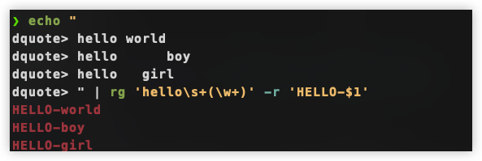

<font size = 5>

# 相关配置

|软硬件|说明|
|:-|:-|
|Computer|MacBookPro|
|CPU|M2[^ann-M2]|
|GPU|M2|
|内存|16G|
|硬盘|512G|
|操作系统|OSX[^ann-OSX]|
|键盘|programmer dvorak|
|输入法|rime|
|包管理器|homebrew|
|终端|Alacritty|
|shell|zsh|
|ls|eza|
|cd|Zoxide|
|find|fd|
|fzf|模糊查找|
|grep|ripgrep|
|sed|sd|
|top|htop|
|编辑器|vim|
|vim扩展|neovim|
|终端复用|tmux|

<br/>

> 左边有些是经典的Unix系统命令, 右边是它的替代品, 如find的替代品为fd


# 键盘
### 布局


<br/>

> 笔者从`qwer`转换来已经4年了, 还是比较后悔的: 之所以这样说是因为这种键盘不适合打中文. 还有一点, 笔者用是的是五笔, 在`qwer`的五笔布局是合理的, dvorak更不适合五笔. 还有一点这种键盘在Mac上默认是没有的, 必须从网络上下载安装. 在有些linux的发行版本上是自带的

### 安装

---


---


---


---


### 相关的网址

1. [安装文档](https://www.kaufmann.no/roland/dvorak/macosx.html)
2. [下载链接](https://www.kaufmann.no/downloads/macos/ProgrammerDvorak-1_2_12.pkg.zip) 


> 下载完毕后直接安装, 按图中4步的顺序就可以了. 不同的系统版本安装可能不一样,在这个网站上也有说明. 

<br/>

`Ubuntu20.04 Server`修改起来要方便的多. 直接在命令行中:

```bash
# step1
### 列出所有的键盘, 并查找目标(美国)
man xkeyboard-config | grep "us(dvp)"       
    |us(dvp)                          English (programmer Dvorak) 


# step2
### 切换root
su -
            

# step3
### 修改配置文件
vim /etc/default/keyboard

XKBMODEL="pc105"
XKBLAYOUT="us"
XKBVARIANT="dvp"            # 直接修改这里就行了, 改为dvp, 其他的不要动
XKBOPTIONS=""
```

> 若是有桌面环境直接在图形化下修改. 笔者写这些是为了以后换设备为自己留个记录

<br/>

# rime
### 简介
笔者是一个追求简洁极致的人, 新起的rime必然成为笔者的选择(<font color=red>也不算新了, 好多年了</font>). 至于为何:
1. rime本身很纯洁, 因为它就是一个映射引擎
2. rime的速度超级快. 笔者用过如搜狗类型的输入法, 在终端键入时, 能明显感觉到和rime的响应速度差距
3. rime有无限可能, 因为它只实现了核心的功能, 通过配置可以定制自己需要的输入法, 所以它的使用门槛很高
4. 最后最重要的一点, 它可以在vim模式下实现中英文模式的Esc切换

> rime是中国人开发的, 在3种平台下都有安装软件. 笔者这里并不会详细讲解rime的配置过程, 后续会出一门rime相关的主题. 目前大家可以直接在百度上搜索安装它. 

<br/>

### rime-vim的Esc切换

在Mac下, rime可以在配置文件中添加相关的配置兼容vim的Esc中文切换, 具体步骤:
1. 打开配置文件(`$HOME/Library/Rime/squirrel.custom.yaml`)
2. 添加如下内容:

```yaml
app_options:                                    # 注意rime的配置文件的语法是yaml, 格式很重要
    com.termius-dmg.mac: # Terminal - Mac       # 这里是默认的, 不要管
      ascii_mode: true
    com.apple.dt.Xcode:
      ascii_mode: true
      no_inline: true
      vim_mode: true
    com.googlecode.iterm2:                      # 从这里开始, 这个对iterm2的兼容
      ascii_mode: true
      no_inline: true
      vim_mode: true
    org.alacritty:                              # Alacritty
      ascii_mode: true
      no_inline: true
      vim_mode: true
    org.vim.MacVim:                             # MacVim
      ascii_mode: true
      no_inline: true
      vim_mode: true

# 这里诸如 com.googlecode.iterm2, org.alacritty是在Mac系统中应用的id
# 查找应用id的方法(有安装包), 以iterm2来说, 具体路径: /Applications/iTerm.app/Contents/Info.plist
#   cat /Applications/iTerm.app/Contents/Info.plist | grep -I CFBundleIdentifer -A 1
# <key>CFBundleIdentifier</key>
# <string>com.googlecode.iterm2</string>
#
# Alacritty, MacVim也是一样的过程.
```

<br/>

# HomeBrew

### 安装
Mac下常用的有homebrew和mackports, 笔者用的是homebrew. [官网文档](https://brew.sh/)(<font color = red>可能要科学上网</font>)


<br/>

### homebrew基础
1. homebrew将命令行与GUI这2类不同的软件分开了, 在homebrew的帮助模式下会见到`Formulae`一般就是命令行软件, `Cask`一般都是桌面应用程序, 在Mac下桌面程序都要注册苹果的签名标识

<br/>

2. 对于M系列的系统, 使用brew命令时, 这样设置`alias brew="arch -arm64 brew"`

<br/>

3. homebrew安装的命令行软件会分2个位置, 以`tmux`为例:
   1. `/opt/homebrew/tmux/3.4.1/bin/tmux`, 真正的可执行文件
   2. `/opt/homebrew/bin/tmux`,  由homebrew创建的软链接, 指向了可执行文件

<br/>

4. 对于GUI程序在Mac上, 可执行文件会安装在系统要求的目录:
    1. `/Libary/Application/xx`, 不安全的软件, 打开时会有安全提示
    2. `/Libary/Application Suporrt/xxx`, 安全的, 一般是商店下载的
    3. 直接在`/opt/homebrew/`相关的目录下


> homebrew下载软件时会访问github, 所以常规操作可能就要换源(<font color = red>homebrew到指定源下载软件</font>). 怎么换源, 上网搜一下就有了

<br/>

 ### 常用命令(注意M芯片的配置)

|命令|说明|举例|
|:-|:-|:-|
|brew doctor|检查brew的当前配置是否合理, 或某些包存在的问题等|略|
|brew upgrade|更新所有已安装的包 |略|
|brew upgrade `包`|更新指定的包 |略|
|brew outdated|列出过期的包, 可以更新|略|
|brew search `包`|模糊搜索包|brew search `alacri`, 会搜索出`Cast Alacritty`或`Formulae alac`|
|brew install `包`|安装包 |略|
|brew uninstall `包`|卸载包|略|
|brew info |显示所有包的信息|略|
|brew info `包`|显示包的信息|略|
|brew list|列出已经安装的所有包|略|
|brew list `--formulae`|列出已经安装的所有命令行程序的包|略|
|brew list `--cask`|列出已经安装的所有GUI程序的包|略|
|brew cleanup -n|查看所有可以清理的包|略|
|brew cleanup|清理所有可以清理的包|略|
|brew cleanup `包`|清理指定的包|略|


<br/>


# Alacritty
### 简介
Mac中流行的是iterm2, 它是一个GUI程序. 它本身实现了很全的功能, 用户通过可视化进行配置, 入门比较低, 适合新来的小伙伴. 对于程序员它太大了, 因为它实现的功能太多所以速度比较慢, 并且大部分功能其实都用不上. 正因如此笔者转到了Alacritty. 相比较Alacritty的优点:
1. 轻量, 像rime一样它主要的目的是为了快, 所以只实现了核心的功能, 用户可以通过配置文件实现好看的界面

<br/>

2. 快[^ann-alacritty-0], 这个体现在渲染模式, 直接使用OpenGL, 比iterm要快很多

<br/>

3. 简单, 正因为它实现的其他修饰功能少, 整个代码是相对简单的, 所以基本没有bug

<br/>

> 在Mac上直接使用homebrew安装(`brew install Alacritty`)

<br/>

### 笔者效果

一个裸装后的Alacritty的界面可能并不好看, 先来看一下笔者目前Alacritty的界面(也未配置完)

---


<br/>

### 配置

上图中的效果是配合了`zsh`, 它是一款shell软件[^ann-zsh-0], 其中所涉及到的插件有:
1. `oh-my-zsh`: 一个著名的zsh插件管理器, 它本身是zsh的脚本
2. `powerlever10k`: 一款zsh的主题, 本身也是zsh的脚本

powerline10k同时还需要相关的字体, 这些都会在后续到了`zsh`后提到. 在这里先介绍Alacritty的配置, 默认情况下安装好Alacritty后, 不会有配置文件[^ann-alacritty-1], 但它会尝试按顺序读取这些文件, 以Mac为例:
1. `$HOME/.config/alacritty/alacrytty.toml`
2. `$HOME/.alacrytty.toml`


也就是说后读取的会覆盖前面已经设置的变量, 效果中相关的Alacritty的配置主要有:
1. `$HOME/.config/alacritty.toml`配置文件
2. 主题(`solarized_dark`)([传送门](https://github.com/alacritty/alacritty-theme))
3. 字体(`MesloLGS NF`)

字体文件可以直接在powerlevel10k的[git](https://github.com/romkatv/powerlevel10k)中下载, 然后安装


---


`alacritty.toml`配置如下:

<br/>


```toml
#  https://alacritty.org/config-alacritty.html  官方配置
# 一般是忽略大小写开头, 在配置文件中,有的是大写开头, 有的是小写, 不要管

import = [
    "$HOME/.config/alacritty/themes/themes/solarized_dark.toml" # 主题
]

[env]
    TERM = "xterm-256color"     

    
[window]
    dynamic_padding = false                  # 在终端周围添加额外的填充
    
    dimensions.columns = 120
    dimensions.lines = 70                   # 打开时多大的窗口

    padding.x = 5
    padding.y = 5                           # 在窗口周围添加空白区域
                                            # 为0则自动调整

    # 左上角菜单栏(关闭,最小化,最大化)
    #decorations = "Full"                    # 和普通窗口一样的, 有菜单栏
    #decorations = "Transparent"             # 有菜单栏, 但背景透明的(Mac only)
    decorations = "Buttonless"              # 启动时没有菜单栏, 但simple full screen后切加来后就变成了Transparent, 估计是一个bug
    #decorations = "None"                    # 没有菜单栏,不能用鼠标拖拽移动了,  并且simple full screen切加来后也没有左上角, 

    opacity = 0.8
    blur = true                             # 透明和模糊

    #startup_mode = "windowed"              # 启动后窗口尺寸, Windowed(默认值)
    #startup_mode = "full"                  # 启动后窗全屏(Mac来说, 会新起一个桌面, 背景是黑色的)
    #startup_mode = "maximized"             # 启动后窗最大化(有桌面的背景)
    #startup_mode = "simpleFullscreen"       # 启动后窗最大化(全屏, 并且有桌面的背景),  设置这几个全屏, 则dimesions不起效

    decorations_theme_variant = "Dark"      # 深色模式
    
    option_as_alt = "Both"                  # 苹果键盘中的option表现的同alt键

[scrolling]
    history = 4000                          # 历史记录只记录到4000行, 最大是100000,默认是1000


[font]
    #normal.family = "Meslo LG S DZ for Powerline"
    normal.family = "MesloLGS NF"
    normal.style = "Bold"
    size = 15
    
    offset.x = 1                            # 字间距
    offset.y = 3                            # 行间距

[cursor]
    style.blinking = "Always"               # 光标闪
    blink_timeout = 0                       # 不要停止闪


# 提示
# Alacritty能通过查找text或link并传送到其他程序
#  "hints" : {
#    "enabled" : [
#        { 
#            "regex"             : "regular expr", 
#            "hyperlinks"        : true or false
#            "post_processing"   : true or false
#            "persist"           : true or false, 
#            "action"            : "Copy" or "Paste" or "Select" or "MoveViModeCursor",
#
#            "command"           : "eg: open/cat"    or
#            "command"           : { "profram" : "process", "args" : ["args"] }
#
#            "binding"           : { "key":"xxx", "mods":"xx", "mode":"xxx"}
#            "mouse"             : { "mods":"xxx", "enable": true or false}
#        }
#    ]
#  }
# [[hints.enabled]]
#    regex               = ""  
#    hyperlinks          = true or false  
#    post_processing     = true or false
#    persist             = true or false  
#    action              = ""  
#
#    command             = "" or   
#    command             = { program = "", ars = [""]}
#
#    binding             = { key = "", mods = ""}  
#    mouse               = { mods = "", enabled = true or false}
#  
#
# [[hints.enabled]]
##   重复上面


[keyboard]
    bindings = [
        # 默认是创建新Alacritty
        {mods = "Command", key = "N", action ="None"},
        # mac command + shift + enter 创建Alacritty
        {mods = "Command | Shift", key = "Enter", action ="SpawnNewInstance"},

        # 默认进入到ViMode的快捷键
        # 在Mac上, Ctrl + Shift + Space的事件不会传递到这里来, 但怕事, 这里最好设置为None
        # 然后设置其他快捷键, 注意在vim程序中时, 这个键也是生效的. 打开后就像vim一样使用就行了
        {mods = "Control | Shift", key = "Space", action ="None"},
        {mods = "Command | Shift", key = "Space", mode = "~Search",  action ="ToggleViMode"},

        # 在当前桌面最大化, 并不会启用mac的新桌面
        {mods = "Command | Shift", key = "M", action = "ToggleSimpleFullscreen"},

        # 禁用窗口的选择
        {mods = "Command", key = "1", action ="None"},
        {mods = "Command", key = "&", action ="SelectTab1"}
    ]
```

<br/>

> Alacritty的功能远远不只些, 用户可以在运行的过程中和Alacritty进行交互, 如在终端向它发送修改配置的命令, 这样可以在不退出Alacritty的情况下使配置生效.

```bash
alacritty msg config "window.opacity=.8"        # 直接发送socket给Alacritty, 修改整个窗口的透明值
```

 
 <br/>

# ls(eza)
### 安装
笔者推荐使用功能较全的[eza](https://github.com/eza-community/eza).  可以用颜色区分不同种类的文件, 包括git. 还有就是速度快


不同平台安装
1. MacOS: `brew install eza`
2. Ubuntu:`apt-get install eza`

<br/>

### 选项(常用)

|缩写|全写|默认|说明|
|:-|:-|:-|:-|
|`-1`|`--oneline`|false|每个文件显示时占1行|
|`-G`|`--grid`|true|网络形式展示|
|`-l`|`--long`|false|详细信息|
|`-R`|`--recurse`|false|递归进入目录|
|`-T`|`--tree`|false|类似tree命令|
|无|`--color=when`|auto|颜色展示(always, auto, never)|
|无|`--color-scale-mode=mode`|fixed|颜色模式(fixed:固定, gradient:渐变)|
|无|`--icons=when`|never|显示图标(always, auto, never)|
|`-a`|`--all`|false|显示隐藏文件|
|`-d`|`--list-dirs`|false|展示当前目录,配合`--absolute`展示当前目录的路径|
|`-D`|`--only-dirs`|false|只展示目录|
|`-f`|`--only-files`|false|只展示非目录的文件|
|无|`--git-ignore`|true|忽略`.gitignore`, 当有`-a`时可以再指定该选项不显示`.gitignore`文件|
|`-I`|`--ignore-glob=(globs)`[^ann-glob]|无|有`-a`时, 手动指定要隐藏的文件(`以|分隔)`|

<br/>

使用`-l`或`--long`以显示详细信息, 此刻可以再指定显示哪些信息
|缩写|全写|说明|
|:-|:-|:-|
|`-b`|`--binary`|二进制前缀文件大小, 如`10K`|
|`-B`|`--bytes`|二进制文件大小, 如`10240`|
|`-g`|`--group`|显示组|
|`-h`|`--header`|每个列展示出标题, 如展示大小的列, 标题为`Size`|
|`-i`|`--inode`|inode号|
|`-m`|`--modified`|显示修改时间(时间戳)|
|`-a`|`--accessed`|显示访问时间(时间戳)|
|`-U`|`--created`|显示创建时间(时间戳)|
|`-S`|`--blocksize`|文件块大小|
|无|`--git`|显示文件的git状态|
|无|`--git-repos`|显示目录的git状态|
|无|`--stdin`|从stdin读取文件名|


<br/>

### 配置
笔者通过eza定义了ls命令相关的展示(如下面的命令)

```bash
alias ls="eza --color=always --no-filesize --icons=always"  
alias l="eza -a -l -h -o -B  -g --time-style=\"+%Y-%m-%d %H:%M:%S\" --git --color=always --icons=always"
alias tree="eza -a -T --git --color=always --icons=always"
```

<br/>

### 效果

直接使用eza自带的tree选项, 不用特意再安装一个tree程序. 因为自定义的命令中要展示图标, 而这种展示依赖于zsh的主题powerlevel10K, 所以笔者决定以截图的方式来给出效果

---


---


--- 


<br/>

# cd(Zoxide)
### 安装配置
笔者使用了[Zoxide](https://github.com/ajeetdsouza/zoxide)来替代传统的cd.

安装(Mac):
1. `brew install zoxide`

2. 配置zsh

```bash
# 在.zshrc中添加该行
#### 使用 --cmd cd 的模式来初始化zoxide是官方推荐的
#### 因为zoxide有一个 zi的命令, 若是直接alias cd="z", 则调用zi时不能使用cdi,而这种方式就可以
eval "$(zoxide init --cmd cd zsh)"
```

3. 配合[fzf](https://github.com/junegunn/fzf), 这个会用单独的章节来学习fzf的使用

4. 如果用户当前已经在用其他的跳转插件, 则可以直接导入这些插件的记录文件到zoxide中. 这个具体见github说明


<br/>

安装配置完后可以配置一些环境变量, 它也是一种配置, 必须在`zoxide`初始化前. 笔者这里只配置了:

```bash
export _ZO_ECHO=0           # 不要在进入目录前打印路径
export _ZO_MAXAGE=2000      # 最多在文件中记录2000条, 默认10000
eval "$(zoxide init --cmd cd zsh)"
```

<br/>

### 简单使用
一个没有跳转记录的zoxide和cd没2样, 但随着不断使用, zoxide的作用越来越强大. 

```bash
cd /tmp/tierry                                              # __dir_1                                                
cd /users/tierry/Desktop/work/company/tencent/metting       # __dir_2


## 假如在历史中cd了这些目录, 此时不管在哪里!!!!

### 进入__dir_1(家目录)
cd                              # 默认回家
cd ~                            # 同上
cd ti                           # 利用了zoxide, 会匹配所有 含有"ti"的目录项, 所以直接回到了 /users/tierry
cd Ti                           # 不区分大小写, 结果同上.  但若有 Tierry目录, 则会进入该目录


### 去 __dir_5
cd metting                      # 直接由zoxide查找进入 __dir_5
cd met                          # 模糊查找, 进入到 __dir_5
cd tierry work tencent met      # 递进查找, 每一项都可以是模糊匹配
cd tie me                       # 同上, 更模糊

## PS: cd met 必须匹配路径的最后一个 ..../metting, 若数据库中记录的是 xxx/metting/xxx, 则跳转是失败的
```

<br/>

> 通过这2个案例可以很形象展示zoxide的基本功能, 用多了基本就离不开了. 


<br/>

# fzf
### 安装
[fzf](https://github.com/junegunn/fzf)不像zoxide或eza有具体的功能, 它可以将接收到内容以交互方式展示到stdout上, 并与用户键入的内容进行模糊匹配, 筛选出内容到命令行中. 说白了就是: 提供列表展示给用户, 用户可以查找条目. fzf在功能上扩展极其广泛, 速度极快.


安装(Mac):
1. `brew install fzf`

2.  加载到环境变量PATH
```bash
# .zshrc
[ -f ~/.fzf.zsh ] && source ~/.fzf.zsh  # 配置文件就是将可执行文件fzf加环境变量
```
3. 配置其他环境变量

```bash
### 系统中没有必要浏览的目录
export OS_LIB_PATHS="Applications,Library,.cache,.cargo,.cocoapods,.gem,.local,.mygit,.oh-my-zsh,.rustup,.rvm,.vim,.Trash"
## 笔者平时学习可能要用到的目录
export TIERRY_STUDY_PATHS="Pods,linux_code,linux_core"


### fzf

# 注解注意看!!!
#   笔者使用fzf总结起来2种模式:
#       1. 直接键入fzf, 其实没多大用, 这个会在后续扩展      __use_style_1
#       2. vim/cat/cd/ls ... + \ + TAB                      __use_style_2
#       3. gof\god函数内部调用到fzf                         __use_style_3
#       
#   __use_style_1: 
#       默认会触发 fzf 的 FZF_DEFAULT_COMMAND环境变量配置的命令, 该命令是rg, 会排除第1类目录:
#           1. OS_LIB_PATHS
#       这1类目录文件主要是系统的库文件, 基本不会动, 平常也不看它们, 这样打开速度会快很多.
#       触发 FZF_DEFUALT_COMMAND的是2个函数gof和god, 主要是选择文件后立即打开, 不粘贴到命令行
#
#   __use_style_2:
#       如"vim \TAB"后会触发 _fzf_compgen_path函数, 该函数由fzf回调出来, 函数内部调用了rg命令,
#       实际数据传回了fzf, 同时排除2类目录. 速度上的确很快. 但有一个问题, 如Pods目录, 当
#       用户在一个工程中想编辑Pods中某个文件时, 使用`vim + \TAB`是找不到的, 这个解决会用单独的
#       脚本函数解决
#
#   PS: "cd \TAB"过程和vim一样, 不过使用的是fd的命令回传给fzf的. 以上这2类都会排除上述2类目录, 大大加快速度
#   
#   __use_style_3:
#       为了解决 __use_style_2中的问题, 会搜索3个学习的目录
#

[ -f ~/.fzf.zsh ] && source ~/.fzf.zsh      # PATH

# fzf要忽略的目录
export FZF_IGNORE_SEARCH_PATHS=".git,node_modules,${OS_LIB_PATHS},${TIERRY_STUDY_PATHS}"
# 某些场景下不能忽略3个学习的目录
export TIERRY_IGNORE_SEARCH_PATHS=".git,node_modules,${OS_LIB_PATHS}"


# fzf搜索引擎替换
### 搜索引擎fd配置
    # -H: 让fd搜索隐藏目录和文件
    # -t: 只要文件
    # --follow: 跟随软链接
    # --exclude: 让fd在搜索时屏蔽的目录(因为这些目录中的文件太多了)
    # PS: 可以在FZF_DEFAULT_OPTS中指定屏蔽目录, 但没有用, 因为fzf默认调用的是系统的find, 它不知道fd去除屏蔽的目录选项, 注意不能换行书写
export FZF_DEFAULT_COMMAND="fd -H -t f --follow --exclude={${TIERRY_IGNORE_SEARCH_PATHS}}"

# 全局的选项, 这些选项是fzf需要的
# -e: abc就匹配abc, 不要匹配a或ab或abc(alt-h:上 alt-b:下)
# -height: 列表窗口的高度(从光标下开始到窗口的底部)
# --tmux 这个先不管, 配合tmux
# --layout=reverse: 输入部分的视图在顶部(默认是底部)
# --bind: 修改上下的选择(默认是Ctrl+n(下), Ctrl+p(上)}
# --preview: 预览视图, 通过脚本内部统一处理,目前Alacritty下展示图片有问题
# --preview-window:预览窗口属性
# 这里可以添加--walker, --walker-skip来指定要搜索文件的类型和屏蔽的目录.
export FZF_DEFAULT_OPTS='-e --walker=file,follow,hidden --walker-skip=${FZF_IGNORE_SEARCH_PATHS} --height=90%  --tmux bottom,40% --layout=reverse --border=bottom --bind=alt-b:down,alt-h:up --preview="$HOME/.myshell/file-preview.sh {}" --preview-window=right:60%:wrap'


# 修改 **TAB 事件为 \TAB
export FZF_COMPLETION_TRIGGER='\'       # **事件触发改为 "\"
_fzf_compgen_path() {
   fd -H -t f --follow --exclude={$FZF_IGNORE_SEARCH_PATHS} . $1
}
_fzf_compgen_dir() {
   fd -H -t d --follow --exclude={$FZF_IGNORE_SEARCH_PATHS} . $1
}

# 下面这2个函数的作用是在选择后立即打开文件或目录, 所以尽量不要在$HOME和$DES下用
gof() {
    IFS=$'\n' files=($(fzf-tmux --query="$1" --multi --select-1 --exit-0))
    [[ -n "$files" ]] && ${EDITOR:-vim} "${files[@]}"
}
god() {
    IFS=$'\n' out=("$(fzf-tmux --query="$1" --exit-0 --expect=ctrl-o,ctrl-e)")
    key=$(head -1 <<< "$out")
    file=$(head -2 <<< "$out" | tail -1)
    if [ -n "$file" ]; then
        [ "$key" = ctrl-o ] && open "$file" || ${EDITOR:-vim} "$file"
    fi
}
```

<br/>


### 使用场景1
从stdin获取数据, 然后选择输出到stdout

---


---

> 图中通过fzf直接回车后, 直接进入了交互模式, 并在列表中将当前目录下所有的文件列举出来(屏蔽了配置中的目录). 当选择文件后, fzf将文件粘贴到了stdout中


<br/>

### 使用场景2
配合其他命令, 如现在想获取`/etc/passwd`下root相关的记录

---


> 其中`-m`表示多选模式


<br/>

### 使用场景3
配合zoxide(cd), 比单纯的使用cd多了可视化的选择, 更方便了

---


> 这里使用cd在家目录下去找目录, 在交互的过程中, 每输入一项后, fzf都会高亮显示然后不停筛选


### 使用场景4
 当前在任意目录下编辑一个层次很深的文件. 可以指定从桌面开始找

---


<br/>


# grep(ripgrep)
### 简介
在文本搜索方面, 笔者用的是[ripgrep](https://github.com/BurntSushi/ripgrep), 号称最快的搜索器. 安装它很简单`brew install ripgrep`, 这将会直接安装可执行程序. 安装完毕后对应的命令即<font color = red>rg</font>, 笔者定义了rep[^ann-ripgrep-0]来引用到它

<br/>

### 测试前提工作
笔者这里以官方使用指南来演示几个案例, 准备工作:
1. 下载测试要用的文件

```bash
curl -LO https://github.com/BurntSushi/ripgrep/archive/0.7.1.zip        
unzip 0.7.1.zip
cd ripgrep-0.7.1
```

<br/>

> 一个一个复制, 进行入最后的目录, 笔者这里放在(`/tmp/.lb/ripgrep-0.7.1/`). 
>
> PS: 里面涉及到颜色, 所以笔者以截图的方式给出测试结果, 对于搜索记录一屏展示不够的, 笔者将以gif图来展示 


<br/>

### 使用场景1
在指定文件中搜索固定的内容, 如在`README.md`中搜索`fast`的行

---


> rg智能的为其加上了颜色, 并打印了所在的行数. 总结: rg默认模式是普通文本. 


<br/>

### 使用场景2
正则搜索. 搜索fast后面有可见字符的内容的行. 这个正则表达式很简单`fast\w{1,}`或`fast\w+`

---


> 正则要求fast紧跟随t后有可见字符, 所以`faster`是符合的

<br/>


### 使用场景3
递归搜索. 若不指定搜索上当, 默认就是递归

---


> 在结果中`src/printer.rs`以及`termcolor/src/lib.rs`这2文件中有匹配. 这里未指定用正则搜索, 但rg认为是正则. 可以通过`-F "fn write(`来确认搜索模式是固定字符串匹配.

<br/>

### 忽略策略
rg搜索时会自动过滤不搜索的文件, 默认情况下:
1. 忽略策略
    - `.gitignore`中规定的文件
    - `.ignore`中规定的文件
    - `.rgignore`中规定的文件
2. 隐藏文件和目录
3. 二进制文件: rg将带有NUL字节的文件认定为二进制文件
4. 不会跟随符号链接

> 在忽略策略是逐级覆盖的. 若有冲突时, 即同一文件在`.gitignore`中被指定了忽略, 但在`.ignore`或`.rgignore`中指定了不忽略, 则rg要在该文件中做匹配查找. 

<br/>

对于忽略策略来举一个场景, 如`.gitignore`文件中有:
```txt
log/
```
这意味着`log`目录以及子目录不会被git追踪. 在使用rg搜索时, 会自动过滤掉log目录. 但现在对于开发者来说, 他想到log目录下搜索一些日志. 此刻就可以在当前的`.gitignore`文件所在的同级目录下创建一个`.ignore`或`.rgignore`, 然后添加:

```txt
!log/
```
这样就可以进入到该目录下搜索, 同时log目录也不会被git追踪. 


<br/>


上述规则可以通过选项来切换

|选项|说明|
|:-|:-|
|`--no-ignore`|禁止所有的忽略|
|`-.`或`--hidden`|要同时搜索隐藏文件和进入隐藏目录下的文件进行搜索|
|`-a`或`--text`|搜索二进制<font color = red>建议不要用</font>|
|`-L`或`--follow`|跟随符号链接|
|`-u`|`--no-ignoe`|
|`-uu`|`--no-ignoe` && `--hidden`|
|`-uuu`|`--no-ignoe` && `--hidden` && `--text`|
|`-uuuu`|`--no-ignoe` && `--hidden` && `--text` && `--follow`|

> rg为了这6条的使用方便, 定制了`--unrestricted`简称`-u`. 重复使用将按上述顺序逐级禁用


<br/>

### 使用场景4
`!`在rg的glob模式中与gitignore的区别. 在gitignore中`!/log`表示允许追踪log目录. 但在rg中却是相反的意思, 表示不允许被搜索. 如:

```bash
rg clap -g '!*.toml'        # 注意用单引号, 因为双引号会被zsh扩展
```
rg匹配时将忽略所有后缀是`toml`的文件. 对于如下:
```bash
rg clap -g '!*.toml' -g '*.toml'
```
遵循gitignore中的覆盖, 所以会搜索所有后缀是`toml`的文件. 具体的案例就不贴图演示了

<br/>

rg对于在指定搜索文件时的glob模式提供了简写的方式, 如:
```txt
-g '*.{cpp.h}'  等效于:
    --type c    全写
    -tc         简写
glob模式下表示后缀是c的源码文件
下面的则表示C类型的文件, 包括.h头文件


-g '*.rs'       等效于:
    --type rust
    -trust      
所有的rust文件


-g '!*.rs'      
    --type-not rust
    -Trust      
过滤所有的rust文件
```

通过`rg --type-list`可以查询rg预定义glob, 如上面提到的C类型的文件

```bash
rg --type-list | rg -i '^C:'
c: *.[chH], *.[chH].in, *.cats          # 前面小写的c就是 --type c 或 -tc 中要指定的c
```

可以添加自定义的glob, 以下这种添加方法只会在当前shell中有效(另一种是配置文件)
```bash
rg --type-add 'web:*.html' --type-add 'web:*.css' --type-add 'web:*.js' -tweb title
#或
$ rg --type-add 'web:*.{html,css,js}' -tweb title
```

<br/>

> 笔者这里举的案例就是官方文档摘抄过来的.

<br/>


rg可以直接在搜索的同时进行文本替换. 例如在某个c++代码工程中需要将所有的`fast`的字符串替换成`FAST`. 在很多编辑器中都有全局查找替换的功能. rg提供了这种功能`--replace`或`-r`. 默认是在内存中作修改, 并将结果输出到stdout上, 实际源文件没变

### 使用场景5
将文本中的fast替换成FAST, 注意不会修改硬盘文件

---


<br/>

### 使用场景6
替换整行. 在rg中有以下几种方案:
1. 正则出fast所在的行(`^.*fast.*$`), 然后替换. 
2. `--only-matching` 或 `-o`结合`-r`: 用户免于写这个正则. 效果是一样的

---


> 最后是越来越简的写法

<br/>


### fg的正则引用
fg也可以使用正则里的引用模式. 概念上是一样的. 这里以下面的案例来说明
1. 匿名引用
2. `$0`
3. 命名引用

> 对于这样的字符串
```txt
hello world
hello      boy
hello   girl
```

> 想要实现的效果是

```txt
HELLO-world
HELLO-boy
HELLO-girl
```

> 匿名引用效果
---



> 正则`hello\s+(\w+)`在匹配成功后有2个匿名:
> 1. `$0`: 表示匹配的整体, 如匹配到第2行时, 就表示`hello      boy`. 这个是隐含的不用指出
> 2. `$1`: 是`(\w+)`的引用,如匹配到第3行时, 就表示`girl`
> 
> rg在处理`-r`选项值时, 会按正则的规则找到`$1`的值然后替换, 所以当替换变成`HELLO-$0`时, 最后结果将是:

```txt
HELLO-hello world
HELLO-hello      boy
HELLO-hello   girl
```

> 可以在正则时指定一个引用的名字

---


> 这个写法是固定的`?P<name>`添加到`(\w+)`中的`w`前面


### 配置规则
rg没有预定的配置文件规则, 但若是配置了环境变量`RIPGREP_CONFIG_PATH`后, 将读取这个配置路径当作配置, 配置文件格式:
1. `#`开头的行是注释
2. 对于有值的选项, 有2种书写格式: 1. 放在一行使用=连接起来; 2. 选项和值写到2行
3. 配置文件中的选项和值会相当于rg的默认选项, 使用时可以指定相同的选项值来覆盖
4. 运行rg时可以指定`--no-config`, 这样可以保证rg本次执行不会读取默认配置

> 看下官方文档给的案例

```txt
--max-columns=150           # 展示结果时, 一行最多150上字符
--max-columns-preview

--type-add
web:*.{html,css,js}*        # 添加自定义glob, 见前面的场景4 

--hidden                    # 搜索隐藏的文件和目录

--glob=!.git/*              # 忽略 .git 目录
# or
#--glob
#!.git/*                    # 第2种写法, 选项--glob 和 值!.git/*分开到2行写
```

<br/>

### 常用选项

|选项|说明|
|:-|:-|
|`--after-context=num`|向后展示num行|
|`--before-context=num`|向前展示num行|
|`--context=num`|向前后展示num行|
|`--context-separator=分隔`|有前后关联行时, 以指定的分隔一个个区域展示, 默认是`--`|
|`--count`或`-c`|统计匹配的行数|
|`--encoding`或`-E`|指定文件编码|
|`--fixed`或`-F`|搜索的内容为纯字符串|
|`--follow`或`-L`|跟随符号链接|
|`--glob`或`-g`|搜索路径的glob模式|
|`--hidden`或`-.`|搜索隐藏的文件和目录|
|`-v`|对条件取反搜索|
|`--json`|以json统计这次搜索性能|
|`--line-number`或`-n`|显示匹配的行号|
|`--max-colums`|最多显示行数|
|`--max-count`|最多匹配到多少次|
|`--max-depath`|最多递归多少层|
|`--no-config`|不要读取配置文件中的选项|
|`--no-ignore`|忽略`ignore`的配置|
|`--no-ignore-dot`|忽略`.ignore`的配置|
|`--no-ignore-exclude`|忽略过滤配置|
|`--pretty`或`-p`|打印更好看|
|`--quiet`或`-q`|不要输出到stdout|
|`--regexp`或`-e`|搜索正则|
|`--replace`或`-r`|替换|
|`--search-zip`或`-z`|搜索zip内的文件|
|`--smart-case`|智能搜索|
|`--threads=num`或`-j`|开启多少条线程来搜索|
|`--type`或`-t`|搜索的文件类型(<font color = red>见场景5</font>)|
|`--type-no`或`-T`|屏蔽搜索的文件类型(<font color = red>见场景5</font>)|
|`--unrestricted`或`-u`|逐级屏蔽忽略策略|
|`--with-filename`或`-H`|每行打印文件名|
|`--word-regexp`或`-w`|匹配单词|
|`--files`|直接在当前上当下列出的有的文件, 这个过程是递归的|
|`--files-with-matches`|只打印文件名|
|`--only-matching`或`-o`|只打印匹配项,当和`-r`结合时替换整行|


<br/>

### fzf使用rg引擎
rg的`--files`可以直接列出指定目录下的所有文件.

```bash
rg --files          # 默认情况下列出的是当前目录下所有文件, 并且这个过程是递归的

rg $DESK --files    # 列出 桌面下所有文件
```

基于这种功能, 可以将fzf的搜索引擎配置成rg.前面已经将fzf的搜索引擎替换成了更快的fd. 实际上fd搜索file的速度几乎和rg列出file的速度一样. rg的速度主要是提现在匹配文本上, 所以换不换无所谓. 在这里笔者将替换为rg, 很重要的一点就是记录下rg的配置. 笔者的配置分为2步:
1. rg配置文件
2. 配置fzf相关的全局变量

像前面所述, rg并没有预设的配置文件, 它会读取一个环境变量`RIPGREP_CONFIG_PATH`,rg通过该变量指定的路径文件在执行每一次的命令时, 都会加载它里面的配置. 笔者的配置如下:

```txt
# 跟随符号链接
--follow

# 搜索隐藏文件
--hidden

# 忽略rg的ignore策略
--no-ignore
```
在zsh的配置文件中添加如下内容:

```bash
#export FZF_DEFAULT_COMMAND="fd -H -t f --follow --exclude={${TIERRY_IGNORE_SEARCH_PATHS}}"

# 搜索引擎rg配置(配置文件, 忽略文件)
export RIPGREP_CONFIG_PATH=$HOME/.myshell/rg.config                 
## 排除的目录更多
export FZF_RG_GLOB="--glob='!"'{'${FZF_IGNORE_SEARCH_PATHS}'}'"'"
## 未排除3个学习的目录
export FZF_NORMAL_RG_GLOB="--glob='!"'{'${TIERRY_IGNORE_SEARCH_PATHS}'}'"'"
## 由fzf回车调用或gof,god调用
#export FZF_DEFAULT_COMMAND="rg --files ${FZF_NORMAL_RG_GLOB}"

# 某些情况下不应该忽略的3个学习目录
export TIERRY_RG_GLOB=${FZF_NORMAL_RG_GLOB}
export TIERRY_RG_COMMAND="rg --files ${TIERRY_RG_GLOB}"


# 修改 **TAB 事件为 \TAB
export FZF_COMPLETION_TRIGGER='\'       # **事件触发改为 "\"
_fzf_compgen_path() {
   #fd -H -t f --follow --exclude={$FZF_IGNORE_SEARCH_PATHS} . $1
   # 必须用eval调用
   eval "rg $1 --files ${FZF_RG_GLOB}"  
}
```

<br/>

> <font color = red>注意注释掉fd这个引擎, 修改`_fzf_compgen_path`里的搜索命令</font>


# sed(sd)
### 简介
sed是一款命令行文本编辑器, 它有着悠久的Unix历史, 一般Unix系统中都会预装它. 它功能虽然强大, 但使用起来比较不方便. 笔者建议安装[sd](https://github.com/chmln/sd), 相比较的优势:
1. 轻松的正则书写, 基于JS,Python的语法
2. 字符串模式
3. 易于阅读
4. 可以根据自己的使用习惯去个性化配置
5. 最重要的是效率, 官方对比下sed是被碾压的

### 安装 
主要介绍2种:
1. `brew install sd`
2. `cargo install sd`

> sd由rust编写, 所以可以用cargo[^ann-cargo]来安装. 笔者使用的是cargo, 当然使用homebrew也没有任何问题


### 使用场景1
默认情况下指定的表达式被视为正则表达式, 使用`-F`或`--fixed-strtings`来禁用
```bash
echo 'lost((([]))) of special chars' | sd -F '((([])))' ''
lost of special chars
```
> 若不指定`-F`则会被视为正则表达式导致报错, 这里将特殊部分替换成空

<br/>

### 使用场景2
去掉前后的空格
```bash
echo '  hello world!!!!   \n' | sd '^\s+.*\s+$'
hello world!!!!
```
> 注意`\s`包括换行


<br/>

### 正则引用
这一点和rg比较像, 也分为2种:
1. 匿名引用
2. 命名引用


用正则获取C函数的类型

--- 


> 上述是一个通用的获取函数类型的正则表达式. 在stdout上只是以可见的颜色显示出来匹配项了. 解释一下该正则
```txt
(\w+[\*\s]*[^\(\),\w])

这个正则的意义是根据C语言中类型定义的标准写出来的, C语言中的类型规则是:
    1. 名字不能有空格,              所以是:\w+,         如int
    2. 可以被*修饰且数量不限,       所以是:\w+\** i     如int*, int**, int***
    3. 名字与*之间空白不限,         所以是:\w+\s*\**,   如int *, int**, int    ****
    4. *之间的空白不限,也就是说*后面可能是空白, 也可能继续有*, 所以是
                                          :\w+\s*\**[\s\*]*  
    5. 将3, 4结合, 类型中的名字与修饰*是空白和*组成, 所以是
                                          :\w[\*\s]*,   如:int*, int* *, int* ** *
    6. 去掉函数声明中函数名以及参数名, 即函数声明中的类型之后不能是:
        (
        )
        ,
        另一个标识符(一定以\w开始)
                                    所以是:\w[\*\s*]*[^\(\),\w]
```

<br/>

> 符合该正则的C函数声明字符串中, 用rg命令可以高亮显示出匹配项. 由于sd命令必须提供修改内容, 所以使用了`$1`原封不动的将字符串又复制回去了,然后高亮显示了出来. sd中还有命名的引用格式和rg一样(`(?P<name>\w+)`等, 引用的时可以`$name`或`${name}` 


### 修改文件
sd支持从文件查找, 默认情况下是直接将结果写回到文件的, 可以添加`-p`查看修改预览

--- 


在Unix中批量修改文件在以前通常使用find和sed来配合. 这里同样可以将sed换成sd做同样的操作. 但目前为止可以直接使用fd和sd来完成同样的操作. 比起以前的组合操作, 这样效率更高.


```bash
# 注意引号, 这种修改不会备份
fd -t f --exec sd 'from "oldcontent"' 'from "newcontent"'       

## 连读执行2个命令
fd -t f --exec cp {} {}.bak \; --exec sd 'from "oldcontent"' 'from "newcontent"'       
```

<br/>

fd命令提供的`--exec` 选项完全是兼容find而来. 传统的sed程序可以同时指定多个文件做修改, 当使用find和sed做批量修改时, 不能确定find是每次搜索调用1次sed还是全部搜索完毕后再统一调用sed, 因为find的文档中未说明.

同样的操作使用fd和sd时, 能确定的是fd执行的模式是每一次有结果了就调用. 这个过程是线程并发的, 不会影响find的搜索. 所以理论上在效率表现上应该会有个峰值. 

> 这个峰值可能与线程,进程开销有关. 但是用户可以指定`--threads`限定线程的数量,但当文件多了会不停在子线程中调用sd而产生进程, 若fd本身是多线程并发则可能这一次的批量修改会不停的创建销毁sd进程, 这就会造成系统资源开销导致修改操作性能下降.

### rg配合sd批量修改文件
rg本身不会将修改的内容写入到文件, 因为它的初忠是为了实现高效率的匹配搜索. 但rg提供了`--files-with-matches`选项, 只会将匹配的文件名输出到stdout上.

> 笔者认为若在搜索时只指定该选项, rg内部一定做优化, 如在`a.log`中搜索`2024`时, 可能该文件中有很多2024字符串, 但若只指定该选项, 则会在匹配到第1个时直接结束匹配将文件名打印到stdout, 接着匹配下一个文件. 所以当文件数量很多时,这种选项的速度会更快找出所有匹配内容的文件

利用rg这个选项使用管道调用sd做批量修改, 效率会很高. rg传递sd的内容是所有匹配的文件, 而sd本身可以直接指定在多个文件中同时修改. 下面是笔者的脚本配置:

```bash
# 用rg及sd修改文件
#   eg: repw "hello world" "HELLO" "-g '*.c'"
#   eg: repw "hello world" "HELLO" -tc
function repw(){        
    if [[ $# -lt 2 ]] || [[ $# -gt 3 ]]; then 
        echo "use: repw old new [search-path]"
        return
    fi

    __path='.'
    if [[ $# -eq 3 ]]; then 
        __path=$3
    fi
    eval "rep -F $1 --files-with-matches $__path | xargs -I _to_path sd -F $1 $2 _to_path"
}
```


<br/>

# top(htop)
这个看一下效果图

--- 


# [vim]
[这里](./vim.md)


# tmux
[这里](./tmux.md)


[^ann-M2]: arm64架构
[^ann-OSX]: 基本是跟着更新的
[^ann-alacritty-0]: 官方称是目前市面上终端最快的. 但本人不知道是不是比Kitty快
[^ann-alacritty-1]: 默认配置文件的格式是toml, 关于这种格式, 小伙伴自行去搜索
[^ann-zsh-0]: zsh是C语言写的软件,就是一个shell, 本质是命令行程序, 主要功能就是接收用户的输入, 然后会系统调用将结果反馈到终端. 同时它会向外界规定配置, 外界用户必须按这种规定提供配置, 并书写它规定的语法, 这些配置路径就是天天听到的配置文件, 也就是大名鼎鼎的shell脚本文件. 配置文件中所要提供的内容基本是环境变量等, 这些变量会被shell程序读取到内存中, shell接收用户的命令时可能用到这些变量
[^ann-ripgrep-0]: 笔者别名有自己定义的规则
[^ann-glob]: glob在Unix中被称为路径匹配, 如`*.c`表示所有`.c`文件. 在很多命令中看到glob模式, 其实都是一样的意义, 只是各自的算法不一样
[^ann-cargo]: 一款rust包管理器, 系统要有rust的环境
[^ann-terminal]: 终端严格来说是一个设备, 从功能上来看, 终端有键盘输入和屏幕输出. 如今终端的概念已经泛化了, 现在用户在窗口环境下用的终端叫虚拟终端, 也称为伪终端, 它模拟了终端所有功能, 它所谓键盘和屏幕实际上由虚拟终端软件来控制的


</font>


