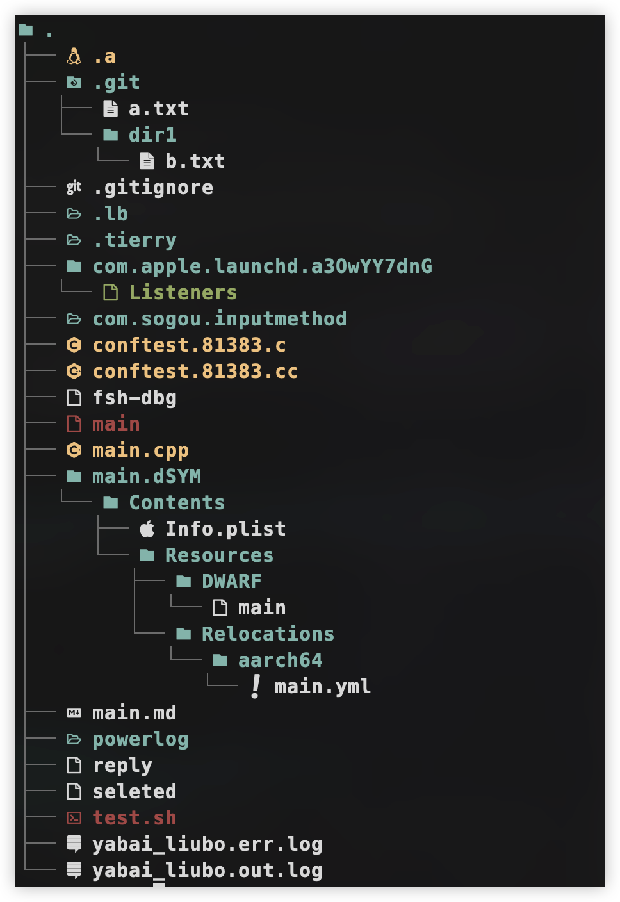
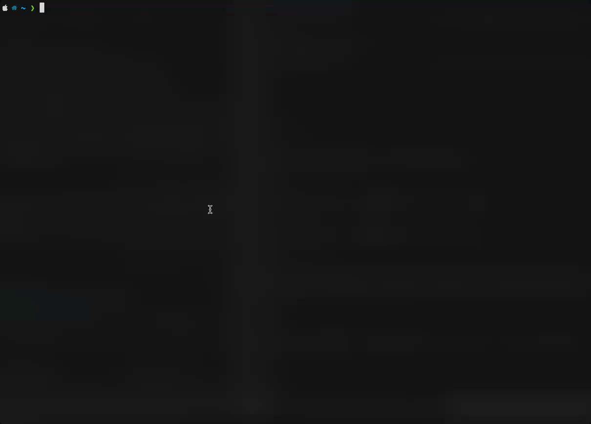

<font size = 5>

# 简介
[fzf](https://github.com/junegunn/fzf)是一个通用的命令行交互式模糊查找器. 具体来说它是一个适用于任何类型列表的交互式过滤程序. 文件,命令历史记录，进程,主机名,书签,git提交等. 它实现了一种模糊匹配算法, 可以快速输入省略字符获取想要的结果.
> 说白了: fzf接收任何能构成列表的记录, 然后给出交互式视图, 用户可以键入关键字筛选出自己想要的结果. fzf是用go语言所写

---


### 特点
1. 没有依赖性
2. 速度极快
3. 可扩展性极强, 主要体现在与其他程序的配合上

### 基本原理 
fzf接收标准输入的数据, 这些数据的形式类似于列表, fzf收到这些数据后将其显示在交互式窗口中供用户筛选, 用户可以按fzf的模糊规则来查找, 最后被fzf筛选出来到标准输出


# 安装
### homebrew方式
1. `brew install fzf`

2.  在当前的zsh中配置fzf
```bash
# 加载fzf的脚本, 里面主要做了:
## 添加fzf的环境变量
## 添加shell的快捷键
[ -f ~/.fzf.zsh ] && source ~/.fzf.zsh  
```
> 还有其他安装方式, 不同的安装方式配置的步骤是不一样的, 可以看[官方说明](https://github.com/junegunn/fzf?tab=readme-ov-file#installation)

### 升级
直接使用对应包管理器, 对于homebrew来说`brew upgrade fzf`就可以了


# 用法
### 无参启动fzf <a id="link-no-arg-start"/>
没有任何参数的fzf将会调用`find`程序将当前目录下所有的文件(<font color = red>递归</font>)展示到交互视图中
> 笔者这里以虚拟机下的linux来演示, 因为该环境下fzf是纯净的.

---


### 接收stdin
fzf最大的作用是接收stdin上的数据
```bash
result="";for i in {1..10}; do result=$result"\nid:"$RANDOM; done; echo $result | fzf --layout reverse
```
这是直接在命令行上键入的shell命令. 来分解一下:
1. `result=""`: 定义一个变量为空字符串, 用来存储格式后的列表字符串
2. 循环:
    - 1次: result为`\nidx:随机值`
    - 2次: result为`\nidx:随机值1\nidx:随机值2`
    - 3次: result为`\nidx:随机值1\nidx:随机值2\nidx:随机值3`
    - ..
3. `echo $result`: 输出结果
4. 第3步的结果通过管道将数据传递给了fzf, 这样fzf将结果呈现在交互视图中, 如下图

---


> 结果中呈现的是`xx/11`, 原因是fzf会默认加一行头部, 这个后面会细说. 最后在交互视图中选中后, fzf会将选中的结果输出到原来的命令行中然后结束交互视图

<br/>

### fzf处理空
fzf接收到空字符串时, 将其打印到标准输出时, 很多情况下没有任何意义. 

```bash
echo "" | fzf           
```
> 键入这句脚本后, fzf也会开启交互视图，但其实列表中没有内容的, 但回车后也会输出换行到屏幕, 这种情况没有意义. 可以使用`--print0`选项, 这样fzf不会打印任何内容到标准标出


### vim场景版本1 
有这样需求: 键入vim时直接在当前目录下选择文件后打开它.

正常情况下在shell中键入vim后, 再按`TAB`shell会给出可编辑的文件让用户选择编辑, 如下图:

---


> 这也是一种交互, 但太单纯了只能`TAB`往后或`Shift-TAB`往前, 如果有大量的文件去TAB效率将大大降低. 所以可以直接利用fzf. 

```bash
vim $(fzf)

# 或

fzf | xargs -I filename vim filename
```

> 这种形式, 用户直接在列表中选择相应的文件后，fzf将该文件输出到`vim `后后面, 再按回车即可打开vim编辑它

<br/>

### vim场景版本2
上面的版本需要在选择后再点击回车才能进入vim编辑, 现在想实现选中后直接进入vim编辑文件. 首先fzf默认不带附加选项时, 只会将选择的结果输出到标准输出, 所以单纯的使用vim并不能实现该功能

在shell中可以使用`eval`和`command`来实现这个功能

```bash
eval "vim $(fzf)"          

# 或

command vim $(fzf)
```
> 这里借助shell的2个内置命令来完成操作, eval需要的是整体的字符串, cmmand后面可以跟随参数, 它们内部来fork出vim， 将参数传递给vim进程


<br/>


# 列表
### 快捷键
当fzf打开交互列表时, 可以移动的方式:
1. 键中的上下键
2. `Ctrl-K`或`Ctrl-P`:上
3. `Ctrl-J`或`Ctrl-N`:下
4. 对于多选模式(`-m`指定), 使用`TAB`选中, `Shift-TAB`取消选中
5. 也支持鼠标操作, 多选时按住shift然后滚动


<br/>

### 显示模式
默认情况下, 交互视图占据全屏, 并且交互的输入框在最底部

---


可以通过选项来调整
```bash
## 进入到 /etc
fzf --height 20         # 从光标下开始展示20行的高度,默认情况下文件从交互视图的底部往上列出来
fzf --height 40%        # 从光标下距离底部的窗口高度 * 0.4的高度展开
fzf --height 40% --border # 交互视图周围用线框起来
fzf --height 40% --border --layout reverse # 文件从光标下往底部开始列出来
fzf --hegiht ~40%       # 用~指定最大高度
```
> PS：笔者虚拟机上的fzf版本较低, 这些选项如`~%40`是有有效的


### tmux模式 <a id="link-tmux"/>
很多用户有tmux环境, fzf提供了tmux的支持. 多窗口时可以将交互视图显示在window的上方, 这样方便操作

```bash
# [center top bottom left right][,xxx(size)] [,xx(size)]
# eg: --tmux center 
fzf --tmux center           # 在tmux中央, width,height默认50%
fzf --tmux 80%              # center, WH:80%
fzf --tmux 100%,50%         # center, W:100%, H:50%
fzf --tmux left,40%         # left, W:40%
fzf --tmux left,40%,90%     # left, W:40%, H:90%
fzf --tmux bottom,40%,90%   # bottom, W:40%, H:90%
```
> 当没有在tmux环境下时, 将自动忽略

<br/>


# 搜索规则
### 模式
默认情况下fzf在交互中输入时, 匹配模式是扩展模式, 并不是固定字符串模式. 可以以空格隔开, 递进搜索, 但是无序的

---


输入`lib`后, 默认是模糊匹配, 只要有`l`,`i`,`b`的都可以匹配出来, 而且是`l-->i-->b`顺序. 但是优先展示的是`lib`, 该图是笔者滚动了交互视图的区域, 排在前面的是`lib`相关的条目

---


输入`lib git zsh`后, fzf的每一组输入都是模糊匹配的规则, `lib`出现, 但`git`相关的匹配和`lib`没有关系, 可能在穿插在lib匹配结果的中间

<br/>

可以在每组前添加`'`告诉fzf, 该组的匹配按固定字符串模式

--- 


此时严格按`lib`字符串匹配. 但若下一组还是模糊匹配的, 匹配原则不变

---


可以发现第1组是严格匹配, 但`li`作为第2组还是模糊匹配, 并且`li`出现的位置并不在`git`后面才出来.


### fzf的匹配算法推导
很明显, 交互时, fzf对用户的键入作时时监听, 每当输入后就会时时的匹配, 并将匹配出的结果刷新在列表中, 下次有字符键入时，以这次的结果作下一次的匹配内容. 所以才会出现乱序. 如:
1. 键入`'git`
2. 筛选出内容有`lib/git/xxx.zsh`
3. 键入`lib`, 则`lib/git/xxx.zsh`也会匹配出来

所以对于下面这个搜索也可以作出解释:

--- 


> 第1次键入`^l`(以l开头)后匹配出的有`lib/xxxx`, 然后第2组键入`l`, `lib/xxxx`当然可以匹配出


### 匹配规则 

|token|模式|说明|
|:-|:-|:-|
|`lib`|模糊匹配|按`l-->i--b`顺序匹配|
|`'lib`|精确匹配|按`lib`匹配|
|`^lib`|精确匹配|以`lib`开头|
|`.lib$`|精确匹配|以`lib`结尾|
|`!lib`|精确匹配|不包含`.lib`|
|`!^lib`|精确匹配|不以`lib`开头|
|`!.lib$`|精确匹配|不以`.lib`结尾|

可以在调用fzf时使用`-e`或`--exact`, 这样在交互时键入的token都被视为精确匹配模式


### OR运算模式
`lib .framework$ | .a$`表示以`lib`开头结尾是`.a`或`.framework`


<br/>

# 环境变量 
### TTY
[前面](#link-no-arg-start)介绍过, fzf在命令行不接收任何参数启动时, 内部默认调用了系统的find命令来查找当前目录下所有的文件并展示在交互视图中. 这种使用在fzf中被称为`FZF_DEFAULT`. 像`echo hello | fzf`的使用不会触发内部的find. 通过配置相关的环境变量可以改变这一行为, 步骤:
1. `FZF_DEFAULT_COMMAND`: fzf无参启动时, 数据从哪里来(<font color = red>默认是find查找的内容</font>). 
2. `FZF_DEFALUT_OPTS`: 为fzf指定本身的选项.
3. `FZF_DEFAULT_OPTS_FILE`: `FZF_DEFAULT_OPTS`可以使用一个文件来替代, 这样做的目的方便管理默认选项


### `FZF_DEFAULT_COMMAND`
其实它就是告诉fzf列表内容的来源, 这里可以来测试:
1. 有这个变量, 但内容是空
2. 有这个变量, 但内容是其他


```bash
## 在 .zshrc中
export FZF_DEFAULT_COMMAND=""
```

---


> 可以发现还是调用了find

<br/>

```bash
export FZF_DEFAULT_COMMAND="eoch 'hello world'"
```

--- 


> 发现该变量里的内容确实改变了无参下fzf的行为


### fzf替换默认的搜索引擎
原理就是指定`FZF_DEFAULT_COMMAND`, 以下是使用`fd`和`ripgrep`来改变fzf的无参默认行为的配置

```bash
export FZF_DEFAULT_COMMAND="fd -H -t f --follow ."
# 或
export FZF_DEFAULT_COMMAND="rg . --files" 
```

> 以上是简单的替换fzf默认的find, fd和rg(<font color = red>ripgrep</font>)搜索速度极快. 


### `FZF_DEFAULT_OPTS`
该环境变量是无参启动fzf时, 默认的选项. 一般情况下会将fzf常用的选项添加进去:
1. `-e`: 搜索时精确匹配
2. `--walker`: fzf间接告诉find搜索的文件类型. <font color = red>若搜索引擎是fd或ripgrep时没有效果</font>, 但为了兼容性最好还是加上:
    - dir: 搜索目录
    - file:搜索文件
    - follow:跟随符号链接
    - hidden:搜索隐藏文件或目录
3. `--walker-skip`: 告诉find不要在什么路径下搜索. 同样搜索引擎是其他时没有效果
    - `--walker-skip=${path1,path2}`
    - 有更多的往后加就行了, 注意格式
4. 布局相关:
    - `--height`
    - `--layout`
    - `--border`
5. 预览视图: 即聚焦切换视图中选项时,要怎么展示. 如有的是图片,有的是pdf, 这就需要区分开用不同的程序去渲染. 后面会有单独的章节介绍预览视图
6. 其他高级的交互选项: 这后面再细说

下面是一个例子<font color = red>注意要写在一行</font>
```bash
export FZF_DEFAULT_OPTS='-e --walker=file,follow,hidden --walker-skip=${.git,node_modules} --height=90%  --tmux bottom,40% --layout=reverse --border=bottom --bind=alt-b:down,alt-h:up --preview="$HOME/.myshell/file-preview.sh {}" --preview-window=right:60%:wrap'

## 多指定了 --tmux选项, 这个配合tmux
### --bind指定了可以使用 Alt+b往下, Alt+h:往上
### --preview将fzf传递的列表值交给 指定的shell脚本去处理, 该脚本的工作就是要区分不同的文件调用不同程序去渲染出预览视图
### --preview-window预览视图布局
```
> 选项中指定了`--walker`相关的是为了兼容, 若fzf的搜索引擎是find(<font color = red>Unix系统原生</font>), 这些选项会被fzf处理并传递到find对应行为的选项. 所以若搜索引擎是`ripgrep`时必须在`FZF_DEFAULT_COMMAND`中指定要对应的选项, 因为fzf本身不知道rg这个程序具体的选项细节.


# 配合shell
### 4个快捷模式
fzf的强大在于可以和其他程序无缝衔接. fzf提供了4个模式:
1. `Ctrl+T`: 获取文件和目录的列表
2. `Alt+C`: 获取目录列表
3. `Ctrl+R`: 获取历史列表
4. `any-cmd [path]**<TAB>`: 任何命令都可以以这种模式调用, 所以这个命令是抽象的, 需要用户自己定义. 它会回调`_fzf_comrun`, 在该函数中用户可以得到的参数:
    - 命令参数`any-cmd $1`
    - 路径`$2`


### `Ctrl+T`
任何命令都可以`cmd Ctrl+T`触发fzf. fzf总会将当前目录下的所有文件(包括目录)列出到交互视图中. 

---


这个过程调用的是find命令, 并不是`FZF_DEFAULT_COMMAND`. fzf提供`FZF_CTRL_T_COMMAND`和`FZF_CTRL_T_OPTS`来改变这一行为.

```txt
export FZF_CTRL_T_COMMAND=$FZF_DEFAULT_COMMAND
export FZF_CTRL_T_OPTS=$FZF_DEFAULT_OPTS
```

这样列表中的条目只有文件没有目录(<font color = red>前面定义时指定fd或rg搜索的是文件</font>), 所以要重新定义该命令

```bash
export FZF_CTRL_T_COMMAND="fd -H --follow ."           
export FZF_CTRL_T_OPTS=$FZF_DEFAULT_OPTS
```
> 这里指定fd搜索目录和文件, 因为rg只能搜索文件. 但是选项可以和`FZF_DEFAULT_OPTS`共用. 当<font color = red>`FZF_CTRL_T_OPTS`为字符串时,快捷键将被禁用</font>


<br/>


### `Alt+C`
它的过程和`Ctrl+T`是一样的, 但它列表中的选项是目录.  fzf也为其提供了2变量来改变它的行为:
1. `FZF_ALT_C_COMMAND`: 可以指定fd搜索目录
2. `FZF_ALT_C_OPTS`: 指定相关的选项


### `Ctrl+R`
任何命令都可以以`cmd Ctrl+R`来触发fzf, fzf会搜索出用户历史命令的记录(读取的shell):
1. 若再次按下`Ctrl+R`将按时间排序. 
2. 使用`Ctrl+N`或`Ctrl+P`上下移动
3. 使用`Ctrl+/`或`Alt+/`将交换命令的顺序

不像前面, fzf只为其定义了选项的变量`FZF_CTRL_R_OPTION`, 一般在该变量里指定高级选项, 这个到后面学习


### `**<TAB>`
任何命都可以以`cmd **<TAB>`触发fzf, 这个过程和前面的不同. 它更抽象, 前面的2个快捷操作(`Ctrl+T`和`Alt+C`)在设计上要求用户返回目录和文件(<font color = red>逻辑上可以输出任何内容到标准输出,但最好是按原则来</font>). 而这里的设计更抽象, fzf向外界回调函数`_fzf_comprun`, 在该函数里用户可以自定义更丰富的操作

在`**<TAB>`行为中, fzf为vim和cd定义了具体的操作:
> 如`vim **<TAB>`触发后, fzf会向外界调用`_fzf_compgen_path`函数, 并将路径`~/`传递到该函数中. 一般情况下该函数的功能是将获取到的所有文件写入到标准输出. 

<br/>

> 再如`cd **<TAB>`触发后, fzf会向外界调用`_fzf_compgen_dir`函数, 并将当前工作目录传递到该函数, 在这个函数中一般是搜索相关的目录写到标准输出, 因为cd本身只能进行目录. 

<br/>

> 在实现这2个回调函数[^ann-cbk]时并不是要改变预定的行为, 要遵循一个原则:该返回目录的返回目录, 该返回文件的就返回文件, 不要改了默认的行为. 用户在函数内要做的是使用高效的程序去搜索目录和文件. <font color = red>若定义了`_fzf_comprun`则vim和cd回调的是comprun</font>


笔者给出这几个相关函数的定义大致定义过程:

```bash
# 供 vim $HOME**tab 的回调函数, 返回文件
_fzf_compgen_path() {
    # 这里的 . 是通配符, 必须指定表示搜索任何文件, 并不是当前目录
    ### $1是$HOME
   fd -H -t f --follow --exclude={$FZF_IGNORE_SEARCH_PATHS} . $1
}

# 供 cd **tab 的回调函数, 返回目录
_fzf_compgen_dir() {
   fd -H -t d --follow --exclude={$FZF_IGNORE_SEARCH_PATHS} . $1
}
```

<br/>

### `_fzf_comprun`
笔者觉得有必要将这个函数拿出来单独强调. 当用户提供了该回调函数后, `vim\cd **<TAB>`的行为将发生改变, 会直接来到这里. 该函数是所有命令以`cmd **<TAB>`所触发. 这里测试一下不同命令下该函数中的参数列表

```bash
## .zshrc中
_fzf_comprun(){
    echo "" > /tmp/a.log
    for arg in $@; do
        echo $arg >> /tmp/a.log
    done;
    echo "over"     # 必须向标准输出输出内容
}
```

> 笔者直接整理了结果:

```bash
rm /tmp/a.log
vim $HOME**             # vim $HOME**<TAB>

cat /tmp/a.log
vim
-m
-q
--walker
file,dir,follow,hidden
--walker-root=/Users/liubo      # 被fzf回调时, 传递的第1个参数是命令名vim, 其余选项是fzf默认规定的, 但路径位于 `--walker-root`


rm /tmp/a.log
cd $HOME**              # cd $HOME**<TAB>
cd
-q
--walker
dir,follow
--walker-root=/Users/liubo      # 对于cd来选项的个数又不一样, 如只有目录, 其他的像路径也一样


rm /tmp/a.log
echo hello world**      # echo hello world**<TAB> 
-m
-q
world
--walker
file,dir,follow,hidden
--walker-root=.                 # 参数和vim一样, 但是路径却是当前目录("."), 并不是指定的hello
```

<br/>

总结: `cmd **<TAB>`被触发时, fzf会传递命令名(<font color = red>$1</font>)以及默认的一些选项`-m -q --walker`等, 路径位于`--walker-root`中, 并且路径必须是合法的, 即以`/`或`./xx`或`../xx`, 所以一般情况下该函数应该处理成如下这样:

```bash
_fzf_comprun() {
  local command=$1
  shift
    # $@是fzf内部传递出来的选项和值, 用户自己参数没有
  case "$command" in
    cd)           fzf --preview 'tree -C {} | head -200'   "$@" ;;
    export|unset) fzf --preview "eval 'echo \$'{}"         "$@" ;;
    ssh)          fzf --preview 'dig {}'                   "$@" ;;
    *)            fzf --preview 'bat -n --color=always {}' "$@" ;;
  esac
}
```

> 这是官方给出的, 从里面可以看出来, 区分了不同的命令, 但最后都是要执行fzf来唤起交互视图

# 选项
fzf功能强大, 可定制性高, 所以内部实现复杂. 通过`man fzf`可以查看所有的功能介绍. 在手册里对功能分了类,下面笔者将简单介绍一下常用的选项


### 搜索功能
|简|全|说明|
|:-|:-|:-|
|`-x`|`--extended`|扩展模式, 这是默认的|
|`+x`|`--no-extended`|上面取反|
|`-e`|`--exact`|精确匹配|
|`-i`|`--ignore-case`|忽略大小写,要是有大写就匹配大写|
|`+i`|`--no-ignore`|不忽略大小写|
|无|`--algo=type`|模糊算法类别,v2最佳评分算法(默认). v1更改但不保证找到最佳结果|

### 搜索结果

|简|全|说明|
|:-|:-|:-|
|`+s`|`--no-sort`|不要对结果排序|
|无|`--tail=NUM`|最多显示多少条数据到列表中|
|无|`--track`|当视图中的结果列表更新时, 让光标继续选择之前的条目|
|无|`--tac`|对结果数据进行反转,如history使用该选项后,最新的在最上面|


### 交互设置
|简|全|说明|
|:-|:-|:-|
|`-m`|`--multi`|多选模式|
|`+m`|`--no-multi`|上面取反|
|无|`--no-mouse`|禁用鼠标|
|无|`--bind=KEYBINDS`|高级操作,后面有单独的章节|


# 高级
### 布局
|简|全|说明|
|:-|:-|:-|
|无|`--height=[~]HEIGHT[%]`|交互视图的高度,从鼠标下到窗口的底部这段区域|
|无|`--tmux`|交互视图位于[tmux](#link-tmux)的上层|
|无|`--layout=LAYOUT`|[见下](#link-layout)|
|无|`--border[=BORDER_OPT`|[见下](#link-border)|
|无|`--border-label`|有上下边框时, 可以在边框上添加标签|
|无|`--border-label-pos`|标签的位置|
|无|`--margin`|[见下](#link-space)|
|无|`--padding`|[见下](#link-space)|
|无|`--info`|[见下](#link-info)|
|无|`--info-command`|[见下](#link-info-command)|
|无|`--separator`|[见下](#link-info-separator)|
|无|`--scrollbar`|[见下](#link-scrollbal)|
|无|`--prompt`|[见下](#link-prompt)|


对于选项`--height`:
1. 若是一个负数, 则交互视图的高度为终端高度送去该值
2. 若指定了`~`时, fzf会自动计算高度, 比如给一个`~100%`时, fzf会根据列表数量来确定高度, 若数量较少,则自动调整合适的高度. 但它使用有以下限制:
    - 不能与以百分比大小给出的顶部,底部边距和填充一起使用
    - 不能使用负值, 即`~-2`
    - 当有多行项目时, 它将找不到正确的尺寸


<a id="link-layout"></a>
对于选项`--layout`, 它表示交互视图从窗口什么地方展示,有3种
1. default: 输入框在最底部, 在输入框上面的是列表视图
2. reverse: 输入框从命令行下开始,下面是列表视图
3. reverse-list: 输入框在窗口底部, 列表视图在命令行下面


<br/>

<a id="link-border"></a>
对于选项`--border`, 它的作用是将交互视图用:
1. rounded: 4周圆角边框
2. sharp: 4周锐角角边框
3. bold: 4周粗线边框
4. double: 4周双线边框
5. horizonal: 有2条边, 一条位于命令行下,一条位于最底部
6. vertical: 有2条边, 一条在视图的左边, 一条在视图的右边
7. top: 只有1条, 位于视图上边
8. left: 同上, 位于左边
9. right: 同上, 位于右边
10. bottom: 同上, 位于下边
11. none:没有边框


<br/>

对于选项`--border-lable`以及`--border-label-pos`:
1. 标签不仅仅是文字, 可以是任何输出到标准输出上的内容
2. 标签问题展示在上或下边框, 所以`--border`指定的模式要包含上下边框
3. pos指定位置的格式:
    - `--border-label-pos=[N[:top|bottom]]`
    - 当不指定top或bottom, 则默认在上边框上展示标签
    - N为正表示从左边起第N个字符开始展示
    - N为负表示标签距离窗口右边多少个字符

---
```bash
## 在上边的center展示
fzf --layout default --border --border-label=$(echo '~~~~~~~~~~~傻逼~~~~~~~~~' | lolcat -f -S 444)

## 在下边距离窗口右边3个字符
fzf --layout default --border --border-label=$(echo '~~~~~~~~~~~傻逼~~~~~~~~~' | lolcat -f -S 444) --border-label-pos=-3:bottom
```


<a id="link-space"></a>
对于选项`--margin`以及`--padding`表示交互视图相关的间距:

---


> 使用格式:
>
> 1. `--margin 5%`: 交互视图距离窗口的上下左右为一样的间距
> 2. `--margin 5%,%10`: 交互视图距离窗口的上下为50%,  左右为10%
> 3. `--margin 5%,%20, 5%`, 交互视图距离窗口的上为5%, 左右为20%, 下为5%  w  
> 4. `--margin 5%,%20, 5%, 10%`, 交互视图距离窗口的上为5%, 右20%, 下5%, 左10%
> 
> padding是一样的用法


<br/>


<a id="link-info"></a>
对于选项`--info`, 它指的是:


它的选项值就是指定它的位置:
1. default: 默认, 位于输入框下, 左边开始
2. right: 同上, 但从右边开始
3. hidden: 不展示
4. inline: 和输入框在同一行, 左边
5. `inline:prefix`: 和输入框在同一行, 但自定义了前缀
6. inline-right: 和输入框在同一行, 但在右边
7. `inline-right:prefix`; 同上,在右边, 并自定义了前缀


----


---


<a id="link-info-command"></a>
对于选项`--info-command`的作用是由外界指定info的内容渲染. 

```bash
fzf --border --info-command='echo "tierry@@:$FZF_POS#$FZF_INFO"'
```

---


> 其中选项的值必须是字符串, 在这里是一个echo命令. 必须用单引号. fzf内部会启动子进程变成shell调用echo, `$FZF_POS`表示info的起始位置, `$FZF_INFO`有原始的info信息(`64/64`)


<a id="link-info-separator"></a>
对于选项`--separator`, 它表示info这条线的样式, 默认是`-`
```bash
fzf --info-command 'echo "tierry@@:$FZF_POS#$FZF_INFO"' --separator=~
```

---


<a id="link-scrollbar"></a>
对于选项`--scrollbar`表示滚动条. 在交互视图中可能出现在列表页及详情页, 对应指定的格式为`--scrollbar=char1[char2]`,其中`char1`表示列表页, `char2`表示详情页. 只能指定ASCII字符, 不能Unicode

```bash
fzf --info-command 'echo "tierry@@:$FZF_POS#$FZF_INFO"' --separator=~ --scrollbar='&{'
```

---


<a id="link-prompt"></a>
对于选项`--prompt`表示输入框左边的字符
```bash
fzf --layout reverse --border --prompt=&
```

---


### 预览

### 绑定

### 执行外部程序

### 刷新

# 高级案例

# 笔者的配置


配置其他环境变量

```bash
### 系统中没有必要浏览的目录
export OS_LIB_PATHS="Applications,Library,.cache,.cargo,.cocoapods,.gem,.local,.mygit,.oh-my-zsh,.rustup,.rvm,.vim,.Trash"
## 笔者平时学习可能要用到的目录
export TIERRY_STUDY_PATHS="Pods,linux_code,linux_core"


### fzf

# 注解注意看!!!
#   笔者使用fzf总结起来2种模式:
#       1. 直接键入fzf, 其实没多大用, 这个会在后续扩展      __use_style_1
#       2. vim/cat/cd/ls ... + \ + TAB                      __use_style_2
#       3. gof\god函数内部调用到fzf                         __use_style_3
#       
#   __use_style_1: 
#       默认会触发 fzf 的 FZF_DEFAULT_COMMAND环境变量配置的命令, 该命令是rg, 会排除第1类目录:
#           1. OS_LIB_PATHS
#       这1类目录文件主要是系统的库文件, 基本不会动, 平常也不看它们, 这样打开速度会快很多.
#       触发 FZF_DEFUALT_COMMAND的是2个函数gof和god, 主要是选择文件后立即打开, 不粘贴到命令行
#
#   __use_style_2:
#       如"vim \TAB"后会触发 _fzf_compgen_path函数, 该函数由fzf回调出来, 函数内部调用了rg命令,
#       实际数据传回了fzf, 同时排除2类目录. 速度上的确很快. 但有一个问题, 如Pods目录, 当
#       用户在一个工程中想编辑Pods中某个文件时, 使用`vim + \TAB`是找不到的, 这个解决会用单独的
#       脚本函数解决
#
#   PS: "cd \TAB"过程和vim一样, 不过使用的是fd的命令回传给fzf的. 以上这2类都会排除上述2类目录, 大大加快速度
#   
#   __use_style_3:
#       为了解决 __use_style_2中的问题, 会搜索3个学习的目录
#

[ -f ~/.fzf.zsh ] && source ~/.fzf.zsh      # PATH

# fzf要忽略的目录
export FZF_IGNORE_SEARCH_PATHS=".git,node_modules,${OS_LIB_PATHS},${TIERRY_STUDY_PATHS}"
# 某些场景下不能忽略3个学习的目录
export TIERRY_IGNORE_SEARCH_PATHS=".git,node_modules,${OS_LIB_PATHS}"


# fzf搜索引擎替换
### 搜索引擎fd配置
    # -H: 让fd搜索隐藏目录和文件
    # -t: 只要文件
    # --follow: 跟随软链接
    # --exclude: 让fd在搜索时屏蔽的目录(因为这些目录中的文件太多了)
    # PS: 可以在FZF_DEFAULT_OPTS中指定屏蔽目录, 但没有用, 因为fzf默认调用的是系统的find, 它不知道fd去除屏蔽的目录选项, 注意不能换行书写
export FZF_DEFAULT_COMMAND="fd -H -t f --follow --exclude={${TIERRY_IGNORE_SEARCH_PATHS}}"

# 全局的选项, 这些选项是fzf需要的
# -e: abc就匹配abc, 不要匹配a或ab或abc(alt-h:上 alt-b:下)
# -height: 列表窗口的高度(从光标下开始到窗口的底部)
# --tmux 这个先不管, 配合tmux
# --layout=reverse: 输入部分的视图在顶部(默认是底部)
# --bind: 修改上下的选择(默认是Ctrl+n(下), Ctrl+p(上)}
# --preview: 预览视图, 通过脚本内部统一处理,目前Alacritty下展示图片有问题
# --preview-window:预览窗口属性
# 这里可以添加--walker, --walker-skip来指定要搜索文件的类型和屏蔽的目录.
export FZF_DEFAULT_OPTS='-e --walker=file,follow,hidden --walker-skip=${FZF_IGNORE_SEARCH_PATHS} --height=90%  --tmux bottom,40% --layout=reverse --border=bottom --bind=alt-b:down,alt-h:up --preview="$HOME/.myshell/file-preview.sh {}" --preview-window=right:60%:wrap'


# 修改 **TAB 事件为 \TAB
export FZF_COMPLETION_TRIGGER='\'       # **事件触发改为 "\"
_fzf_compgen_path() {
   fd -H -t f --follow --exclude={$FZF_IGNORE_SEARCH_PATHS} . $1
}
_fzf_compgen_dir() {
   fd -H -t d --follow --exclude={$FZF_IGNORE_SEARCH_PATHS} . $1
}

# 下面这2个函数的作用是在选择后立即打开文件或目录, 所以尽量不要在$HOME和$DES下用
gof() {
    IFS=$'\n' files=($(fzf-tmux --query="$1" --multi --select-1 --exit-0))
    [[ -n "$files" ]] && ${EDITOR:-vim} "${files[@]}"
}
god() {
    IFS=$'\n' out=("$(fzf-tmux --query="$1" --exit-0 --expect=ctrl-o,ctrl-e)")
    key=$(head -1 <<< "$out")
    file=$(head -2 <<< "$out" | tail -1)
    if [ -n "$file" ]; then
        [ "$key" = ctrl-o ] && open "$file" || ${EDITOR:-vim} "$file"
    fi
}
```

<br/>


### 使用场景1
从stdin获取数据, 然后选择输出到stdout

---




---

> 图中通过fzf直接回车后, 直接进入了交互模式, 并在列表中将当前目录下所有的文件列举出来(屏蔽了配置中的目录). 当选择文件后, fzf将文件粘贴到了stdout中


<br/>

### 使用场景2
配合其他命令, 如现在想获取`/etc/passwd`下root相关的记录

---



> 其中`-m`表示多选模式


<br/>

### 使用场景3
配合zoxide(cd), 比单纯的使用cd多了可视化的选择, 更方便了

---


> 这里使用cd在家目录下去找目录, 在交互的过程中, 每输入一项后, fzf都会高亮显示然后不停筛选


### 使用场景4
 当前在任意目录下编辑一个层次很深的文件. 可以指定从桌面开始找

---


<br/>

### fzf专题


[^ann-cbk]: 回调函数是编程中的一种事件响应机制, 这里不细说. 在这里就是fzf在处理`vim **<TAB>`时, 需要外界告诉它列表的内容, 所以fzf调用该函数. 在函数内部由外界决定输出什么内容


</font>
