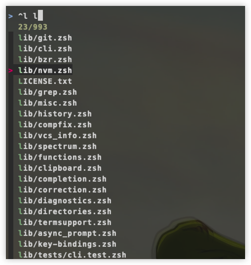

<font size = 5>

# 简介
[fzf](https://github.com/junegunn/fzf)是一个通用的命令行交互式模糊查找器. 具体来说它是一个适用于任何类型列表的交互式过滤程序, 文件,命令历史记录，进程,主机名,书签,git提交等. 它实现了一种模糊匹配算法, 可以快速输入省略字符获取想要的结果.
> 说白了: fzf接收任何能构成列表的记录, 然后给出交互式视图, 用户可以键入关键字筛选出自己想要的结果. fzf是用go语言所写

---


### 特点
1. 没有依赖性
2. 速度极快
3. 可扩展性极强, 主要体现在与其他程序的配合上

### 基本原理 
fzf接收标准输入的数据, 这些数据的形式类似于列表, fzf收到这些数据后将其显示在交互式窗口中供用户筛选, 用户可以按fzf的模糊规则来查找, 最后被fzf筛选出来到标准输出


# 安装
### homebrew方式
1. `brew install fzf`

2.  在当前的zsh中配置fzf
```bash
# 若文件存在, 则加载它. .fzf.zsh主要功能是添加可执行文件fzf的路径到环境变量
[ -f ~/.fzf.zsh ] && source ~/.fzf.zsh  
```
> 还有其他安装方式, 不同的安装方式配置的步骤是不一样的, 可以看[官方说明](https://github.com/junegunn/fzf?tab=readme-ov-file#installation)

### 升级
直接使用对应包管理器, 对于homebrew来说`brew upgrade fzf`就可以了


# 用法
### 无参启动fzf
没有任何参数的fzf将会调用`find`程序将当前目录下所有的文件(<font color = red>递归</font>)展示到交互视图中
> 笔者这里以虚拟机下的linux来演示, 因为该环境下fzf是纯净的.

---


### 接收stdin
fzf最大的作用是接收stdin上的数据
```bash
result="";for i in {1..10}; do result=$result"\nid:"$RANDOM; done; echo $result | fzf --layout reverse
```
这是直接在命令行上键入的shell命令. 来分解一下:
1. `result=""`: 定义一个变量为空字符串, 用来存储格式后的列表字符串
2. 循环:
    - 1次: result为`\nidx:随机值`
    - 2次: result为`\nidx:随机值1\nidx:随机值2`
    - 3次: result为`\nidx:随机值1\nidx:随机值2\nidx:随机值3`
    - ..
3. `echo $result`: 输出结果
4. 第3步的结果通过管道将数据传递给了fzf, 这样fzf将结果呈现在交互视图中, 如下图

---


> 结果中呈现的是`xx/11`, 原因是fzf会默认加一行头部, 这个后面会细说. 最后在交互视图中选中后, fzf会将选中的结果输出到原来的命令行中然后结束交互视图

<br/>

### fzf处理空
fzf接收到空字符串时, 将其打印到标准输出时, 很多情况下没有任何意义. 

```bash
echo "" | fzf           
```
> 键入这句脚本后, fzf也会开启交互视图，但其实列表中没有内容的, 但回车后也会输出换行到屏幕, 这种情况没有意义. 可以使用`--print0`选项, 这样fzf不会打印任何内容到标准标出


### vim场景版本1
有这样需求: 键入vim时直接在当前目录下选择文件后打开它.

正常情况下在shell中键入vim后, 再按`TAB`shell会给出可编辑的文件让用户选择编辑, 如下图:

---


> 这也是一种交互, 但太单纯了只能`TAB`往后或`Shift-TAB`往前, 如果有大量的文件去TAB效率将大大降低. 所以可以直接利用fzf. 

```bash
vim $(fzf)
```

> 这种形式, 用户直接在列表中选择相应的文件后，fzf将该文件输出到`vim `后后面, 再按回车即可打开vim编辑它


<br/>


# 列表
### 快捷键
当fzf打开交互列表时, 可以移动的方式:
1. 键中的上下键
2. `Ctrl-K`或`Ctrl-P`:上
3. `Ctrl-J`或`Ctrl-N`:下
4. 对于多选模式(`-m`指定), 使用`TAB`选中, `Shift-TAB`取消选中
5. 也支持鼠标操作, 多选时按住shift然后滚动


<br/>

### 显示模式
默认情况下, 交互视图占据全屏, 并且交互的输入框在最底部

---


可以通过选项来调整
```bash
## 进入到 /etc
fzf --height 20         # 从光标下开始展示20行的高度,默认情况下文件从交互视图的底部往上列出来
fzf --height 40%        # 从光标下距离底部的窗口高度 * 0.4的高度展开
fzf --height 40% --border # 交互视图周围用线框起来
fzf --height 40% --border --layout reverse # 文件从光标下往底部开始列出来
fzf --hegiht ~40%       # 用~指定最大高度
```
> PS：笔者虚拟机上的fzf版本较低, 这些选项如`~%40`是有有效的


### tmux模式
很多用户有tmux环境, fzf提供了tmux的支持. 多窗口时可以将交互视图显示在window的上方, 这样方便操作

```bash
# [center top bottom left right][,xxx(size)] [,xx(size)]
# eg: --tmux center 
fzf --tmux center           # 在tmux中央, width,height默认50%
fzf --tmux 80%              # center, WH:80%
fzf --tmux 100%,50%         # center, W:100%, H:50%
fzf --tmux left,40%         # left, W:40%
fzf --tmux left,40%,90%     # left, W:40%, H:90%
fzf --tmux bottom,40%,90%   # bottom, W:40%, H:90%
```
> 当没有在tmux环境下时, 将自动忽略

<br/>


# 搜索规则
### 模式
默认情况下fzf在交互中输入时, 匹配模式是扩展模式, 并不是固定字符串模式. 可以以空格隔开, 递进搜索, 但是无序的

---


输入`lib`后, 默认是模糊匹配, 只要有`l`,`i`,`b`的都可以匹配出来, 而且是`l-->i-->b`顺序. 但是优先展示的是`lib`, 该图是笔者滚动了交互视图的区域, 排在前面的是`lib`相关的条目

---


输入`lib git zsh`后, fzf的每一组输入都是模糊匹配的规则, `lib`出现, 但`git`相关的匹配和`lib`没有关系, 可能在穿插在lib匹配结果的中间

<br/>

可以在每组前添加`'`告诉fzf, 该组的匹配按固定字符串模式

--- 


此时严格按`lib`字符串匹配. 但若下一组还是模糊匹配的, 匹配原则不变

---


可以发现第1组是严格匹配, 但`li`作为第2组还是模糊匹配, 并且`li`出现的位置并不在`git`后面才出来.


### fzf的匹配算法推导
很明显, 交互时, fzf对用户的键入作时时监听, 每当输入后就会时时的匹配, 并将匹配出的结果刷新在列表中, 下次有字符键入时，以这次的结果作下一次的匹配内容. 所以才会出现乱序. 如:
1. 键入`'git`
2. 筛选出内容有`lib/git/xxx.zsh`
3. 键入`lib`, 则`lib/git/xxx.zsh`也会匹配出来

所以对于下面这个搜索也可以作出解释:

--- 



> 第1次键入`^l`(以l开头)后匹配出的有`lib/xxxx`, 然后第2组键入`l`, `lib/xxxx`当然可以匹配出


### 匹配规则 

|token|模式|说明|
|:-|:-|:-|
|`lib`|模糊匹配|按`l-->i--b`顺序匹配|
|`'lib`|精确匹配|按`lib`匹配|
|`^lib`|精确匹配|以`lib`开头|
|`.lib$`|精确匹配|以`lib`结尾|
|`!lib`|精确匹配|不包含`.lib`|
|`!^lib`|精确匹配|不以`lib`开头|
|`!.lib$`|精确匹配|不以`.lib`结尾|

可以在调用fzf时使用`-e`或`--exact`, 这样在交互时键入的token都被视为精确匹配模式


### OR运算模式
`lib .framework$ | .a$`表示以`lib`开头结尾是`.a`或`.framework`


<br/>

### 环境变量 


配置其他环境变量

```bash
### 系统中没有必要浏览的目录
export OS_LIB_PATHS="Applications,Library,.cache,.cargo,.cocoapods,.gem,.local,.mygit,.oh-my-zsh,.rustup,.rvm,.vim,.Trash"
## 笔者平时学习可能要用到的目录
export TIERRY_STUDY_PATHS="Pods,linux_code,linux_core"


### fzf

# 注解注意看!!!
#   笔者使用fzf总结起来2种模式:
#       1. 直接键入fzf, 其实没多大用, 这个会在后续扩展      __use_style_1
#       2. vim/cat/cd/ls ... + \ + TAB                      __use_style_2
#       3. gof\god函数内部调用到fzf                         __use_style_3
#       
#   __use_style_1: 
#       默认会触发 fzf 的 FZF_DEFAULT_COMMAND环境变量配置的命令, 该命令是rg, 会排除第1类目录:
#           1. OS_LIB_PATHS
#       这1类目录文件主要是系统的库文件, 基本不会动, 平常也不看它们, 这样打开速度会快很多.
#       触发 FZF_DEFUALT_COMMAND的是2个函数gof和god, 主要是选择文件后立即打开, 不粘贴到命令行
#
#   __use_style_2:
#       如"vim \TAB"后会触发 _fzf_compgen_path函数, 该函数由fzf回调出来, 函数内部调用了rg命令,
#       实际数据传回了fzf, 同时排除2类目录. 速度上的确很快. 但有一个问题, 如Pods目录, 当
#       用户在一个工程中想编辑Pods中某个文件时, 使用`vim + \TAB`是找不到的, 这个解决会用单独的
#       脚本函数解决
#
#   PS: "cd \TAB"过程和vim一样, 不过使用的是fd的命令回传给fzf的. 以上这2类都会排除上述2类目录, 大大加快速度
#   
#   __use_style_3:
#       为了解决 __use_style_2中的问题, 会搜索3个学习的目录
#

[ -f ~/.fzf.zsh ] && source ~/.fzf.zsh      # PATH

# fzf要忽略的目录
export FZF_IGNORE_SEARCH_PATHS=".git,node_modules,${OS_LIB_PATHS},${TIERRY_STUDY_PATHS}"
# 某些场景下不能忽略3个学习的目录
export TIERRY_IGNORE_SEARCH_PATHS=".git,node_modules,${OS_LIB_PATHS}"


# fzf搜索引擎替换
### 搜索引擎fd配置
    # -H: 让fd搜索隐藏目录和文件
    # -t: 只要文件
    # --follow: 跟随软链接
    # --exclude: 让fd在搜索时屏蔽的目录(因为这些目录中的文件太多了)
    # PS: 可以在FZF_DEFAULT_OPTS中指定屏蔽目录, 但没有用, 因为fzf默认调用的是系统的find, 它不知道fd去除屏蔽的目录选项, 注意不能换行书写
export FZF_DEFAULT_COMMAND="fd -H -t f --follow --exclude={${TIERRY_IGNORE_SEARCH_PATHS}}"

# 全局的选项, 这些选项是fzf需要的
# -e: abc就匹配abc, 不要匹配a或ab或abc(alt-h:上 alt-b:下)
# -height: 列表窗口的高度(从光标下开始到窗口的底部)
# --tmux 这个先不管, 配合tmux
# --layout=reverse: 输入部分的视图在顶部(默认是底部)
# --bind: 修改上下的选择(默认是Ctrl+n(下), Ctrl+p(上)}
# --preview: 预览视图, 通过脚本内部统一处理,目前Alacritty下展示图片有问题
# --preview-window:预览窗口属性
# 这里可以添加--walker, --walker-skip来指定要搜索文件的类型和屏蔽的目录.
export FZF_DEFAULT_OPTS='-e --walker=file,follow,hidden --walker-skip=${FZF_IGNORE_SEARCH_PATHS} --height=90%  --tmux bottom,40% --layout=reverse --border=bottom --bind=alt-b:down,alt-h:up --preview="$HOME/.myshell/file-preview.sh {}" --preview-window=right:60%:wrap'


# 修改 **TAB 事件为 \TAB
export FZF_COMPLETION_TRIGGER='\'       # **事件触发改为 "\"
_fzf_compgen_path() {
   fd -H -t f --follow --exclude={$FZF_IGNORE_SEARCH_PATHS} . $1
}
_fzf_compgen_dir() {
   fd -H -t d --follow --exclude={$FZF_IGNORE_SEARCH_PATHS} . $1
}

# 下面这2个函数的作用是在选择后立即打开文件或目录, 所以尽量不要在$HOME和$DES下用
gof() {
    IFS=$'\n' files=($(fzf-tmux --query="$1" --multi --select-1 --exit-0))
    [[ -n "$files" ]] && ${EDITOR:-vim} "${files[@]}"
}
god() {
    IFS=$'\n' out=("$(fzf-tmux --query="$1" --exit-0 --expect=ctrl-o,ctrl-e)")
    key=$(head -1 <<< "$out")
    file=$(head -2 <<< "$out" | tail -1)
    if [ -n "$file" ]; then
        [ "$key" = ctrl-o ] && open "$file" || ${EDITOR:-vim} "$file"
    fi
}
```

<br/>


### 使用场景1
从stdin获取数据, 然后选择输出到stdout

---


---

> 图中通过fzf直接回车后, 直接进入了交互模式, 并在列表中将当前目录下所有的文件列举出来(屏蔽了配置中的目录). 当选择文件后, fzf将文件粘贴到了stdout中


<br/>

### 使用场景2
配合其他命令, 如现在想获取`/etc/passwd`下root相关的记录

---


> 其中`-m`表示多选模式


<br/>

### 使用场景3
配合zoxide(cd), 比单纯的使用cd多了可视化的选择, 更方便了

---


> 这里使用cd在家目录下去找目录, 在交互的过程中, 每输入一项后, fzf都会高亮显示然后不停筛选


### 使用场景4
 当前在任意目录下编辑一个层次很深的文件. 可以指定从桌面开始找

---


<br/>

### fzf专题


</font>
