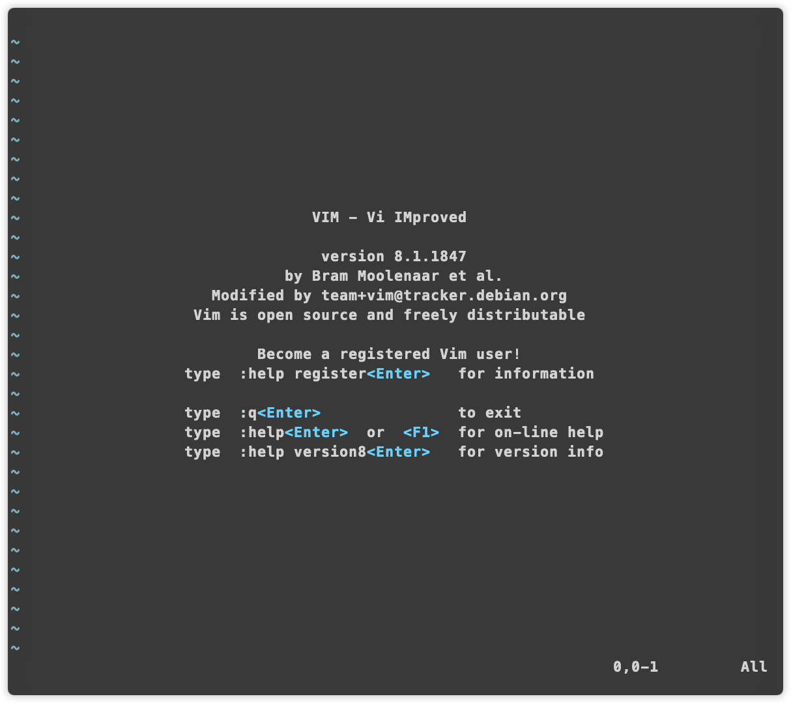
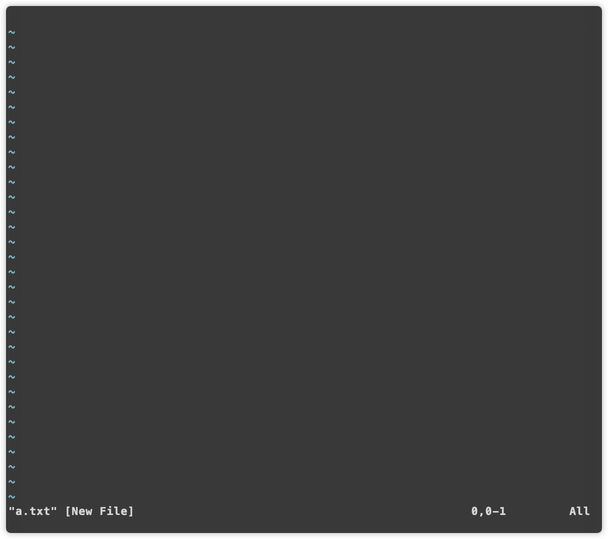
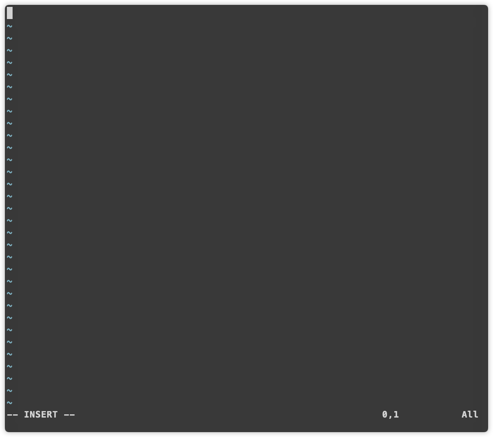

### 夸一下[vim](https://github.com/vim/vim)
笔者只用一句来形容它: 史上最伟大的软件之一. 网上关于vim的教学铺天盖地. 很多热忠vim的人自称自己是vimer, 在很多人心中vim俨然成为了一种哲学, 可见vim在全世界有多受欢迎. 全世界知名的IDE厂商基本都会或多或少的去适配vim模式. 甚至有些程序员可能因为vim而放弃一款功能强大的软件, 原因就是没有vim或vim适配的不好. 

笔者说这一些绝对没有夸大的成分, 可以这么说, 使用vim的人或多或少有一些共通的地方, 如:极简主义, 高度洁癖, 高高在上, 冷酷等. 这一类的人极具个性, 在人群中与众不同. 他们吸引着别人, 也让别人感受到vim并强迫自己去学习接受vim. 然而事与愿违, vim的使用门槛极高, 让很多人尝试到失败的滋味而且放弃vim, 虽然导致vim流失了大量潜在的用户, 但笔者认为这是一件好事!! 因为这不仅没让vim没落反而更添vim的神秘色彩. 一款好的软件理论上由用户数量来决定其成功与否, 但vim是特殊的, 在编辑器领域vim的使用数量或许不是最多的, 但它是最成功的, 它有着编辑器之神的美誉. 我想这是所有vimer心中的信仰. 笔者心中vim的哲学:高效率的懒

### 简介
vim是一款终端IO软件, 主要用来编辑文件的. 它是对`vi`的大幅改进, 如今的vim还是完全兼容vi的, 但其实功能要比vi强大太多. 可以完全视为2种不同的编辑器.

vim的特点是在键盘上完成文本的所有编辑操作, 这对那些习惯使用鼠标的小伙伴来说是致命的, 仅仅是vim最基本的操作就劝退了90%的人. 但熟悉vim机制后, 在键盘上编辑文本要比键盘和鼠标操作快的多. 

### 安装
现在一些Linux, Unix的发行版都会预装它, 但原始安装的vim在编译时会去掉很多功能, 这会导致vim后续的功能扩展出问题, 所以笔者建议重新装: `brew install vim`. 其他平台下到[git](https://github.com/vim/vim)下查看.
> 可以自己下载源码编译安装, 这样可以定制需要的功能, 具体还是看官方. 笔者安装的版本是`9.1`

### vim的帮助文档
[在这里](https://yianwillis.github.io/vimcdoc/doc/help.html)

### 说明
笔者将制作表格, 用来收集整理vim的模式及按键功能. 以笔者的习惯会将目前自己记不住但又很好用的按键放到最前面标上红色. 对于已经滚瓜滥熟的会放在后面.

### 关闭vi的兼容
vim虽然兼容了vi, 但从使用上来说, 最好关闭这种模式, 即在命令模式下`:set nocompatible`. 后面笔者所有操作前提都是关闭了兼容模式

### 普通模式表格
|按键|功能|说明|
|:-|:-|:-|
|J|删除换行|相当于连接相邻2行|
|k|光标上移|和up一样的效果|
|j|光标下移|和down一样的效果|
|h|光标左移|和left一样的效果|
|l|光标右移|和right一样的效果|
|x|删除当前光标字符|-|
|dd|删除光标所在行|-|
|u|还原上一次删除的内容|-|

### 选项

### 启动vim

---

上图是在命令行键入`vim`回车后的界面, 从这个图里可得到下面这些信息:
1. vim是vi的改进(improved)
2. 版本号[^ann-version-0], 8.1
3. vim是开源并且自由发布的
4. 因为是自由的, 所以开发vim的资金全靠捐助(sponsor), 为此vim软件在帮助中提供了一个单独的区域来介绍vim的赞助`:help sponsor`, 里面具体是vim资金的赞助以及vim获利资金的用途, 如何成为赞助等
5. 退出`:q<Enter>`. 许多人第1次进入vim后因为不习惯规则, 不知道怎么操作vim, 其实vim打开界面已经告诉你了, 只是有很多小伙伴忽略它了
6. 最后2个帮助:在线帮助, 一般是使用手册; 查看版本

打开vim更常见的方式是指定它要打开的文件, 如下图: 打开一个新的文件`a.txt`.

---

上图是开一个新文件后的界面, 相比较直接进入vim, 这里少了很多信息, 这张图注意图会集中在:
1. `~`: 这种字符开关的行不能进行编辑, 即表示文件内容不存在
2. 最底部: 文件名, 并指明这是一个新文件. 这一行的信息是临时的, 后续编辑的过程中会被覆盖

### vim的模式-0
vim是一个多模式编辑器, 即在不同模式下,对应的操作是不一样的. 普通模式下键入的字符只是命令, 并不能正常的编辑文件. 只有在插入模式下才可以对文本进行编辑, 进入插入模式直接在普通模式下键入`i`. 

> 上图是进入插入模式后的视图, 在最底部有提示`-- INSERT --`, 这种情况下就可以正常的输入内容了, 在插入模式下和其他编辑器的功能是一样的, 可以使用`up left down right`进行方向的移动.

可以键入`<Esc>`回到普通模式. 许多小伙伴不知道自己当前在什么模式, 其实大部分情况下键入`<Esc>`时不管现在处于什么模式都会回到普通模式.

### 普通模式下移动光标
vim中第1个亮点来了: 回到普通模式后许多小伙伴不会操作了!! 在普通模式下, 键入的字符只是命令, 一定要记住这一点. 先来说移动光标:
- h: 左
- j: 下
- k: 上
- l: 右

这4个是vim在普通模式下移动光标的命令, 也可以再使用`up left down right`的方向键移动, 但效率没有这4个键高, 因为手会从键盘离开去敲击方向键, 然后再回来. 如果频度不高, 还可以接受, 但在编辑的过程移动光标的频率是很高的, 若不停在方向键区和键盘打字区来回移动, 不仅累, 效率还低, 所以vim出了这套移动设计

### 普通模式下删除命令
要删除一个字符, 可以将光标移动这该字符上然后键入`x`, 连续键入则是连续往后删除. 如果要是删除一行, 可以以这种方法连续键入x, 但vim提供了更好的方法: 将光标停留在要删除的行, 直接键入2次`d`, 这样后面的行会往上填补

### 撤销与重做
要实现其他编辑器中`Ctrl+Z`的效果则在普通模式上键入`u`, 连续键入则不停的往前还原

[^ann-version-0]: 笔者最开始是在虚拟机中演示, 装的一个新的vim. Mac上安装的是9

